# b2t Codebase Guide

A complete, beginner-friendly walkthrough of this repository: every folder, every
module, and every function, plus how all the pieces fit together. It is written
for someone in their first software job (or a student) who has just cloned the
project and wants to understand exactly how it works, from the entry points all
the way to the final PDF.

You do not need to know LaTeX, Typst, or LangGraph before reading. Terms are
explained the first time they appear, and there is a [glossary](#19-glossary) at
the end. Read this top to bottom: it is ordered so that each idea is explained
before it is used.

---

## Table of contents

1. [What problem does b2t solve?](#1-what-problem-does-b2t-solve)
2. [Words you will need (quick vocabulary)](#2-words-you-will-need-quick-vocabulary)
3. [The 30-second mental model](#3-the-30-second-mental-model)
4. [Repository layout](#4-repository-layout)
5. [The foundation: shared state and configuration](#5-the-foundation-shared-state-and-configuration)
6. [Entry point A: the library (`app.py`)](#6-entry-point-a-the-library-apppy)
7. [The LLM seam: client, prompts, and the shared runner](#7-the-llm-seam-client-prompts-and-the-shared-runner)
8. [The pipeline definition (`graph.py`)](#8-the-pipeline-definition-graphpy)
9. [The nodes (`nodes/*.py`)](#9-the-nodes-nodespy)
10. [The deterministic LaTeX helpers (`latex/*.py`)](#10-the-deterministic-latex-helpers-latexpy)
11. [The Typst helpers](#11-the-typst-helpers)
12. [Logging (`log.py`)](#12-logging-logpy)
13. [Entry point B: the web app (`api/`)](#13-entry-point-b-the-web-app-api)
14. [The browser UI (`api/static/`)](#14-the-browser-ui-apistatic)
15. [End-to-end traces](#15-end-to-end-traces)
16. [The tests (`tests/`)](#16-the-tests-tests)
17. [Continuous integration (`.github/workflows/`)](#17-continuous-integration-githubworkflows)
18. [How to run it yourself](#18-how-to-run-it-yourself)
19. [Glossary](#19-glossary)
20. [Where to start reading the source](#20-where-to-start-reading-the-source)

---

## 1. What problem does b2t solve?

Many university lecturers write their slides in **LaTeX Beamer**. Beamer is a
LaTeX package for making slide decks. It looks great, but it has a serious
limitation: the PDFs it produces are **not tagged**. "Tagging" is the hidden
structure inside a PDF that a screen reader uses to read a document aloud in the
right order to a blind or visually impaired person. Without tags, a screen reader
sees only a jumble.

**Typst** is a newer typesetting system (think of it as a modern alternative to
LaTeX), and **Touying** is a Typst package for making slide decks. Crucially,
Typst *can* produce tagged, accessible PDFs.

So the goal of b2t (short for **B**eamer **2** **T**ouying) is:

> Take a Beamer deck a professor already has, and automatically rewrite it as an
> equivalent Touying deck, so it can be compiled into an accessible PDF.

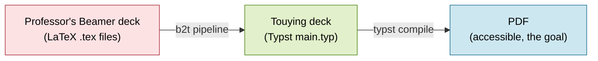

A few important ground rules the project sets for itself (you will see these
enforced in the code):

- **No LaTeX, ever.** The input decks are *already compiled*. b2t never installs
  or runs a LaTeX toolchain. It only reads the source files.
- **Deterministic first.** Anything that can be done with plain, predictable
  Python (copying files, deleting junk, find-and-replace) is done that way. An AI
  model is used for *one* thing only: the actual Beamer-to-Typst translation,
  which needs judgment.
- **The compiler is the judge.** A conversion is "done" only when `typst compile`
  actually succeeds and produces a PDF.
- **Never touch the user's files.** All work happens on a *copy* of the input.

> **Note on scope.** This guide describes **v0**, the smallest working version: it
> handles plain decks (titles, sections, text, bullet lists, basic math, images).
> Bigger features (accessibility tagging, bibliographies, diagram conversion) are
> on the roadmap in `CLAUDE.md` but not built yet. However, two pieces of
> *foundation* for the bigger roadmap are already in place even though there is
> still only one AI step: a **prompt registry** (versioned prompt files) and
> **per-node model and prompt-version selection** with provenance. These are
> introduced now, while the project is small, so every future AI step inherits the
> same shape. The testing UI and a **continuous-integration** workflow are also in.

---

## 2. Words you will need (quick vocabulary)

You will meet these terms throughout. Skim now, refer back as needed. There is a
fuller [glossary](#19-glossary) at the end.

| Term                | Plain-English meaning                                                                          |
| ------------------- | ---------------------------------------------------------------------------------------------- |
| **LaTeX / Beamer**  | A document language; Beamer is its slide-deck package. The *input* format.                     |
| **Typst / Touying** | A newer document language; Touying is its slide-deck package. The *output* format.             |
| **Compile**         | Turn source code (`.tex` or `.typ`) into a finished PDF.                                       |
| **Pipeline**        | A fixed sequence of steps, each one feeding the next.                                          |
| **Node**            | One step in the pipeline (here, a small Python function).                                      |
| **State**           | A single object that carries all the data through the pipeline; each node fills in a bit more. |
| **LangGraph**       | A small library for wiring nodes into a pipeline (a "graph") and running them in order.        |
| **Pydantic**        | A Python library for defining data objects with typed fields that validate themselves.         |
| **LLM**             | "Large Language Model" - the AI (e.g. GPT, Llama). Used for the one translation step.          |
| **Deterministic**   | Always gives the same output for the same input (no AI, no randomness).                        |
| **FastAPI**         | A Python library for building web servers / APIs. Powers the browser UI.                       |
| **Protocol**        | A Python way to say "any object with these methods will do" - used to make the AI swappable.   |
| **Prompt registry** | Versioned prompt files on disk (under `prompts/`), one folder per AI node.                     |
| **Prompt version**  | One specific prompt for a node (e.g. `convert/v1`): a system instruction plus a user template. |
| **Provenance**      | A record of *what actually ran*: which model and prompt version each AI node used.             |
| **TOML**            | A simple config file format; here, each prompt version is one `.toml` file.                    |
| **CI**              | "Continuous integration" - a server that runs the test suite automatically on every push.      |

---

## 3. The 30-second mental model

b2t converts a compiled LaTeX Beamer slide deck into a Typst Touying deck and
compiles it to a PDF. There are **two ways to run it**:

1. **As a library** - call one Python function:
   `b2t.app.convert_deck(input_dir, output_dir)`.
2. **As a web app** - start a server (`b2t.api.app:app`) and use the browser UI.

Both paths build and run the **same pipeline**: a fixed, straight-line chain of
**eight steps** ("nodes"). **Seven nodes are plain Python.** **One node calls an
AI model** to do the actual Beamer-to-Typst translation. A single object,
`PipelineState`, is passed through all eight nodes; each node reads some of its
fields and writes others.

The one AI node does not talk to a model directly. It goes through a small, swappable
**client** (`llm.py`) and pulls its wording from a **prompt registry** (`prompts/`)
via a shared helper (`nodes/_llm.py`). That indirection is what makes the model
mockable in tests and the prompt versionable in git.

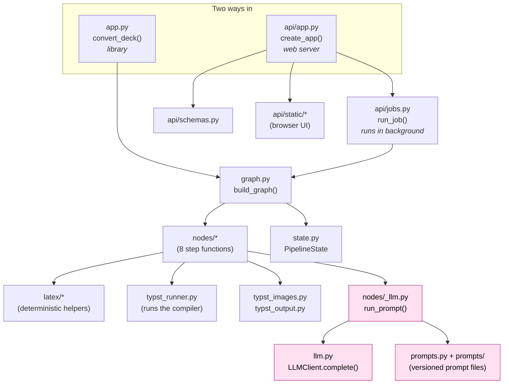

The pink boxes are the only places the AI step lives. Everything else is ordinary,
testable Python.

---

## 4. Repository layout

```txt
b2t/
  pyproject.toml          project metadata, dependencies, pytest config
  README.md               short usage notes
  CLAUDE.md               project rules and roadmap (for AI assistants and devs)
  CODEBASE_GUIDE.md       this file
  uv.lock                 exact locked dependency versions

  src/b2t/                the actual Python package
    __init__.py           one-line package docstring (no logic)
    config.py             constants: paths, the model catalog, build-file extensions
    state.py              PipelineState plus the LLM selection/provenance submodels
    graph.py              build_graph(): wires the 8 nodes into a pipeline
    app.py                convert_deck(): the library entry point
    llm.py                the LLM client interface + real and fake implementations
    prompts.py            the prompt registry loader + template renderer
    log.py                setup_logging(): console + rotating file logs
    typst_runner.py       runs `typst compile`, captures the result
    typst_images.py       rewrites image() paths in generated Typst
    typst_output.py       strips a markdown code fence the model may add

    nodes/                one file per pipeline step (thin wrappers)
      _llm.py             run_prompt(): the shared helper every AI node uses
      copy_input.py  clean_build.py  detect_main.py  flatten.py
      strip_overlays.py  convert.py  write_output.py  compile.py

    latex/                the deterministic LaTeX logic the nodes call
      aspect.py  cleanup.py  detect.py  includes.py  flatten.py  overlays.py

    api/                  the web layer
      app.py              FastAPI app + HTTP endpoints (web entry point)
      jobs.py             background job runner + in-memory job store
      schemas.py          Pydantic request/response models
      state_view.py       JSON-safe state serializer + per-node snapshot folding
      static/             index.html, app.js, style.css (the browser UI)

  prompts/                the prompt registry (versioned AI wording, see section 7)
    defaults.json         { "convert": "v2" }: the default version per node
    convert/v1.toml       the original convert prompt (kept for history)
    convert/v2.toml       the default: adds the aspect-ratio directive

  files/                  data the converter reads (not code)
    reference/touying_reference_presentation.typ   the canonical example deck
    md/guides/            math, accessibility, and UA-1 rules (markdown)
    md/pkg_docs/          per-package docs, loaded on demand (future features)

  docs/superpowers/       design specs and implementation plans (process artifacts)
    specs/                one design document per feature
    plans/                one step-by-step implementation plan per feature

  tests/                  pytest suite (160 tests across 21 files) + fixtures
    conftest.py           shared fixture (a writable copy of the sample deck)
    fixtures/sample_deck/ a minimal Beamer deck used throughout the tests
    test_*.py             one test module per source module

  .github/workflows/ci.yml   the continuous-integration workflow (see section 17)
  logs/b2t.log               rotating debug log (gitignored)
```

Two "empty" layers worth noting: `nodes/__init__.py` and `latex/__init__.py` are
empty marker files. `src/b2t/__init__.py` and `src/b2t/api/__init__.py` contain
only a one-line docstring. They exist so Python treats these folders as importable
packages; they carry no logic.

> **Why `src/b2t/` and not just `b2t/`?** Putting the package under `src/` is a
> common Python convention ("src layout") that prevents accidentally importing the
> package from the project root instead of the installed copy. You do not need to
> worry about it day to day.

---

## 5. The foundation: shared state and configuration

Before the entry points, understand the two files everything else depends on: the
shared data object and the constants.

### 5.1 `state.py` - the object that flows through the pipeline

This file defines the data that travels through the pipeline. The main class is
`PipelineState`, a Pydantic `BaseModel`. Think of it as a **form that gets filled
in field by field** as the deck moves through the pipeline. It is the single
source of truth that every node reads from and writes to.

Pydantic gives us two things for free: the fields are **typed** (e.g. `Path`,
`str | None`), and Pydantic **validates** them, so a wrong type fails immediately
instead of causing a confusing bug later.

There are three tiny helper models alongside `PipelineState`, all about the AI step:

- `NodeChoice` - a per-node *request*: `model: str | None` and
  `prompt_version: str | None`. `None` means "use the default". This is what the
  UI sends in to say, for example, "run the convert node on model X with prompt v2".
- `NodeRun` - a per-node *record of what ran*: `model: str`, `prompt_version: str`.
  This is the **provenance**, filled in after the node runs.
- `RenderedPrompt` - the *exact* `system` and `user` text an AI node sent. It is
  captured so the UI can show the real prompt after a run. It is large, so it is
  kept separate from the smaller provenance record.

`PipelineState`'s fields, grouped by *who fills them in*:

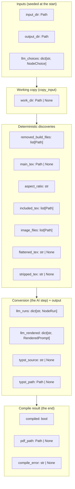

What each field means:

- **Inputs** (set when the pipeline starts):
  - `input_dir` - the original deck folder. Treated as read-only.
  - `output_dir` - where the final `main.typ`, images, and PDF are written.
  - `llm_choices` - per-node `{model, prompt_version}` selections, empty by
    default (so every AI node uses its defaults). Seeded from the UI or the
    library caller.
- **Working copy** (set by the first node):
  - `work_dir` - the temporary folder holding the copied deck.
- **Deterministic discoveries** (filled in by the plain-Python nodes):
  - `removed_build_files` - build artifacts that were deleted.
  - `main_tex` - the detected main Beamer file.
  - `aspect_ratio` - the Touying aspect ratio ("4-3", "16-9", ...) read from
    the beamer documentclass; defaults to "4-3".
  - `included_tex` - the `\input`/`\include`d files found.
  - `image_files` - the images the deck references.
  - `flattened_tex` - all the LaTeX merged into one string.
  - `stripped_tex` - the flattened LaTeX with overlays removed.
- **Conversion** (the AI step), provenance, and the written output:
  - `llm_runs` - provenance: what model and prompt version each AI node used.
  - `llm_rendered` - the exact prompt each AI node sent (for the UI preview).
  - `typst_source` - the generated Typst code.
  - `typst_path` - where that code was written on disk.
- **Compile result** (the final node):
  - `compiled` - did `typst compile` succeed?
  - `pdf_path` - the resulting PDF, on success.
  - `compile_error` - the error text, on failure.

There is no real logic here; the classes are pure data. **The field order in this
file roughly mirrors the order the pipeline fills the fields in**, so this one file
doubles as a map of the whole process.

### 5.2 `config.py` - constants, paths, and the model catalog

No logic, just values the rest of the code imports.

- `REPO_ROOT` - the project root, computed from this file's location
  (`Path(__file__).resolve().parents[2]`). Everything else is anchored to it, so
  the code works no matter where the repo is cloned.
- `REFERENCE_DECK` - path to
  `files/reference/touying_reference_presentation.typ`, the known-good example
  deck the AI is given as a template.
- `MATH_GUIDE` - path to `files/md/guides/math_equations_in_typst.md`, also given
  to the AI.
- `PROMPTS_DIR` - path to the `prompts/` folder (the prompt registry, section 7).
- `DEFAULT_TYPST_NAME = "main.typ"` - the filename for generated Typst.
- `OPENROUTER_BASE_URL = "https://openrouter.ai/api/v1"` - the default AI provider
  endpoint (more on this in section 7).
- `class ModelInfo(BaseModel)` - describes one selectable AI model: its `id`
  (e.g. `openai/gpt-oss-120b`), `complexity` (size, e.g. "120B MoE"), `strength`
  (`frontier`/`strong`/`capable`/`basic`), and `reasoning` level. It has a
  `label` property that builds the human-readable string shown in the UI
  dropdown, e.g. `gpt-oss-120b - frontier, high reasoning, 120B MoE`.
- `OPEN_MODELS` - a tuple of `ModelInfo` entries: the open-weight models the user
  can pick from. They are ordered strongest first.
- `DEFAULT_MODEL = OPEN_MODELS[0].id` - the model used when none is chosen
  (`openai/gpt-oss-120b`).
- `BUILD_FILE_EXTENSIONS` - a long tuple of file extensions that count as LaTeX
  build junk (`.aux`, `.log`, `.nav`, `.synctex.gz`, and many more). The cleanup
  step uses this list.

> **Why only open-weight models?** The project deliberately lists only
> open-source model families (gpt-oss, Qwen, Llama, Gemma, Mistral). The idea is
> that a university could later self-host the very same models on its own servers
> behind an OpenAI-compatible endpoint, instead of depending on a paid API. See
> the README's "Models" section.

---

## 6. Entry point A: the library (`app.py`)

This is the simplest way in, and the best place to start tracing execution. The
whole library is one public function.

### `convert_deck(input_dir, output_dir, client=None, llm_choices=None) -> dict`

Step by step:

1. `load_dotenv()` - loads environment variables from a `.env` file, so secrets
   like `OPENROUTER_API_KEY` are available without hard-coding them.
2. `setup_logging()` - turns on logging (console + a rotating file; see
   section 12).
3. `client = client or OpenRouterClient()` - if the caller did not pass an AI
   client, it creates the real one. **Tests pass a `FakeClient` here** so they
   never hit the network.
4. `graph = build_graph(client)` - constructs the pipeline (section 8), handing it
   the chosen client.
5. `graph.invoke({"input_dir": ..., "output_dir": ..., "llm_choices": ...})` - runs
   the whole pipeline synchronously (start to finish, in order) and returns the
   final state as a plain dictionary. `llm_choices` defaults to `{}` (every AI node
   uses its defaults).
6. It logs success (with the PDF path) or failure (with the compile error), then
   returns the final state dict.

So the entire library surface is: **seed two paths (and optionally per-node
choices), run the graph, get a dict back.** Everything interesting happens inside
the graph.

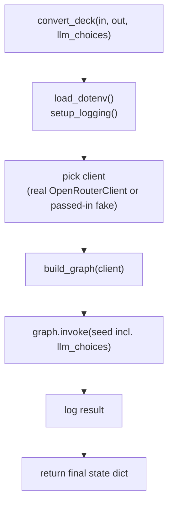

---

## 7. The LLM seam: client, prompts, and the shared runner

The `convert` node is the only one that calls an AI. To keep that call isolated,
testable, and versionable, the AI step is split into three small pieces:

- **`llm.py`** - *how* to call a model (a generic client with one method).
- **`prompts.py` + `prompts/`** - *what* to say (versioned prompt files).
- **`nodes/_llm.py`** - the glue that picks the model and prompt, renders the
  prompt, calls the client, and records what ran.

Because the model is chosen per call and the wording lives in files, adding a new
AI node later means writing a prompt file and a thin node function - nothing in the
client or the registry has to change.

### 7.1 `llm.py` - the generic model client

All AI access goes through a tiny interface defined here. The rest of the code
never imports an AI SDK directly, and tests can swap in a fake.

#### `LLMClient` (Protocol)

A `Protocol` is Python's way of describing a shape rather than a concrete class.
It says: "anything with this method counts as a client." Here the method is:

```python
def complete(self, system: str, user: str, model: str) -> str: ...
```

Note three things: the method is **generic** (it does not know about Beamer or
Typst, it just sends a system message and a user message), and the **model is a
per-call argument** (not stored on the client), and it is a Protocol so
implementations do **not** need to inherit anything.

#### Two implementations

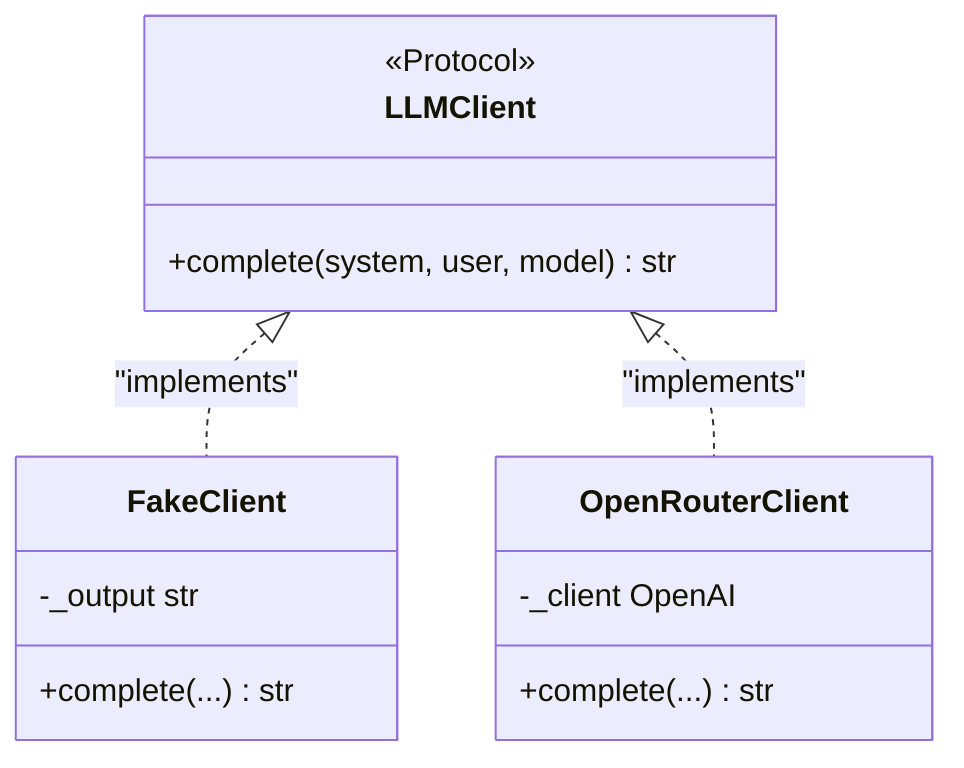

**`FakeClient`** - the test/offline implementation. You construct it with a fixed
`output` string (default `"= Placeholder\n"`). Its `complete(...)` ignores its
inputs and always returns that string. This is what keeps the test suite fast,
free, and offline, and it is also what the UI's "use fake converter" checkbox
selects.

**`OpenRouterClient`** - the real implementation. It talks to
[OpenRouter](https://openrouter.ai), a service that exposes many models behind one
**OpenAI-compatible** API (so the official `openai` Python client can talk to it
just by changing the base URL).

- `__init__(self)`:
  - Creates an `OpenAI` client pointed at `B2T_BASE_URL` if set, otherwise
    `OPENROUTER_BASE_URL`. (Pointing `B2T_BASE_URL` at a campus server is how a
    university would later self-host.)
  - Reads the API key from the `OPENROUTER_API_KEY` environment variable. If it is
    missing, this raises `KeyError` immediately - a clear, early failure.
- `complete(self, system, user, model)`:
  - Logs "calling {model} via chat completions".
  - Calls `self._client.chat.completions.create(...)` with the system and user
    messages and the given model (this is the standard **Chat Completions** API).
  - Returns `response.choices[0].message.content` - the model's text.
  - Network or provider errors are not caught here; they propagate up to whoever
    called the pipeline, which records them as a failed job.

> **Environment variables at a glance:**
> `OPENROUTER_API_KEY` (required for real runs), `B2T_MODEL` (optional model
> override), `B2T_BASE_URL` (optional endpoint override). All are usually set in a
> `.env` file in the repo root.

### 7.2 The prompt registry (`prompts/` and `prompts.py`)

Instead of hard-coding the AI instructions in Python, b2t keeps them as **versioned
files on disk**. Git becomes the prompt history, prompts are code-reviewable, and a
bad output can be traced back to the exact wording that produced it.

The layout is one folder per AI node, one `.toml` file per version, plus a defaults
file:

```txt
prompts/
  defaults.json          { "convert": "v2" }   the default version per node
  convert/
    v1.toml              the original prompt (kept for history)
    v2.toml              the default: adds the aspect-ratio directive
```

Each version file is **TOML** (a simple config format read with Python's built-in
`tomllib`, so there is no new dependency) with three keys:

- `description` - an optional human label shown in the UI version dropdown.
- `system` - the system instruction (what the AI always receives).
- `user_template` - the user-message template, containing `{{token}}` markers.

The values use literal triple-quoted TOML strings (`'''...'''`), so LaTeX and
Typst characters like `\frac` and `$` need no escaping.

`prompts.py` is the loader and renderer:

- `render(template, values) -> str` - replaces each `{{name}}` in the template with
  `values["name"]`. It only scans the *template*; the injected values are inserted
  verbatim and never re-scanned, so braces and dollar signs inside them are
  untouched. An unknown `{{token}}` raises `KeyError` (a typo guard).
- `PromptVersion` (a dataclass) - the parsed form of one version file: `node`,
  `version`, `system`, `user_template`, `description`.
- `list_nodes(base=PROMPTS_DIR)` - the node names: subfolders of `prompts/` that
  hold at least one `.toml`. (This doubles as the definition of "which nodes are AI
  nodes": a node is an AI node when its name appears here.)
- `list_versions(node, base=...)` - the version ids (the `.toml` filename stems) for
  a node, sorted.
- `default_version(node, base=...)` - the default version for a node, read from
  `defaults.json`; raises `KeyError` if the node is missing (fail loud).
- `load(node, version, base=...)` - parses one version file into a `PromptVersion`;
  raises `FileNotFoundError` if the file is missing and `KeyError` if `system` or
  `user_template` is absent.

The default `convert/v2.toml` prompt holds today's only AI instruction: a `system`
message that says "convert Beamer to Typst Touying using the university theme,
follow the reference and the math guide, output only Typst, never use overlays",
and a `user_template` that stacks the reference deck, the guides, an aspect-ratio
directive, and the source via the tokens `{{reference}}`, `{{guides}}`,
`{{aspect_ratio}}`, and `{{source}}`. (`v1` is the same prompt without the
aspect-ratio directive, kept for provenance; the convert node always supplies the
`aspect_ratio` value, which `v1` simply ignores.)

### 7.3 `nodes/_llm.py` - the shared runner

Every AI node is a thin wrapper over one helper, so that resolving the model and
version, rendering the prompt, calling the client, and recording provenance all
happen in exactly one place.

```python
def run_prompt(state, node_name, client, values) -> tuple[str, NodeRun, RenderedPrompt]:
    choice = state.llm_choices.get(node_name) or NodeChoice()
    model = choice.model or os.getenv("B2T_MODEL") or DEFAULT_MODEL
    version = choice.prompt_version or prompts.default_version(node_name)
    pv = prompts.load(node_name, version)
    user = prompts.render(pv.user_template, values)
    output = client.complete(pv.system, user, model)
    return output, NodeRun(model=model, prompt_version=version), RenderedPrompt(system=pv.system, user=user)
```

In words, `run_prompt`:

1. Looks up this node's `NodeChoice` from `state.llm_choices` (or an empty one).
2. Resolves the **model**: the choice, else the `B2T_MODEL` env var, else
   `DEFAULT_MODEL`.
3. Resolves the **prompt version**: the choice, else the registry default.
4. Loads that prompt version and renders its `user_template` with the supplied
   token `values`.
5. Calls `client.complete(system, user, model)`.
6. Returns three things: the model output, a `NodeRun` (provenance), and a
   `RenderedPrompt` (the exact text sent, for the UI preview).

### 7.4 How selection and provenance flow

Putting 7.1-7.3 together: the UI (or library caller) seeds `state.llm_choices`
*before* the run. During the run, each AI node calls `run_prompt`, which reads its
choice and records a `NodeRun` into `state.llm_runs` and a `RenderedPrompt` into
`state.llm_rendered`. After the run, the web layer exposes both: a small provenance
summary (what ran) and, on demand, the full rendered prompt (what was sent).

Today only the `convert` node exists, so `llm_choices`, `llm_runs`, and
`llm_rendered` each have at most one entry (`"convert"`). The shape is deliberately
general so future AI nodes need no new plumbing.

---

## 8. The pipeline definition (`graph.py`)

### `build_graph(client: LLMClient)`

This function wires the eight node functions into a LangGraph `StateGraph` (a graph
whose shared data type is `PipelineState`), then compiles and returns it. The body
does three things:

1. **Registers nodes** with `graph.add_node(name, fn)`. Seven nodes are added
   directly. The `convert` node is special: `convert_node` needs the client as a
   second argument, so it is bound with `partial(convert_node, client=client)`.
   `functools.partial` pre-fills the `client` argument, producing a function
   LangGraph can call with just the state. (LangGraph always calls a node with one
   argument: the current state.)
2. **Adds edges** with `graph.add_edge(...)` to form one straight line.
3. **Returns `graph.compile()`** - a runnable graph object exposing `.invoke()`
   (run once, return the final state) and `.stream()` (run and emit events as it
   goes; the web layer uses this for live progress).

The graph is intentionally **linear**: no branches, no loops, no conditional edges.
That makes the control flow trivial to follow, and it is why the node order is
fixed.

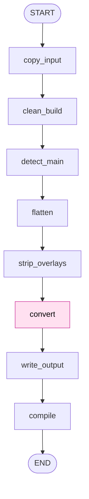

The shaded `convert` is the only AI node. Every other node is deterministic.

> **What does "compile the graph" mean here?** Nothing to do with `typst compile`.
> LangGraph "compiles" the graph definition into an optimized, runnable object,
> the same way a recipe is turned into something you can actually execute.

---

## 9. The nodes (`nodes/*.py`)

Each node is a **thin function**: it takes the current `PipelineState` and returns
a **dictionary of just the fields it wants to update**. Returning a partial dict is
the LangGraph convention; the framework merges it into the running state. The real
work lives in the `latex/`, `nodes/_llm`, `typst_runner`, `typst_images`, and
`typst_output` helpers, which the nodes call. This keeps the nodes short and the
logic unit-testable on its own.

The table below is the heart of the data flow: which node reads what, and writes
what.

| #   | Node             | Reads from state                            | Writes to state                                | Delegates to                                             |
| --- | ---------------- | ------------------------------------------- | ---------------------------------------------- | -------------------------------------------------------- |
| 1   | `copy_input`     | `input_dir`                                 | `work_dir`                                     | (stdlib only)                                            |
| 2   | `clean_build`    | `work_dir`                                  | `removed_build_files`                          | `latex.cleanup.remove_build_files`                       |
| 3   | `detect_main`    | `work_dir`                                  | `main_tex`, `aspect_ratio`                     | `latex.detect.find_main_tex`, `latex.aspect.aspect_ratio` |
| 4   | `flatten`        | `main_tex`                                  | `included_tex`, `image_files`, `flattened_tex` | `latex.includes.parse_includes`, `latex.flatten.flatten` |
| 5   | `strip_overlays` | `flattened_tex`                             | `stripped_tex`                                 | `latex.overlays.strip_overlays`                          |
| 6   | `convert`        | `stripped_tex`, `aspect_ratio`, `llm_choices` | `typst_source`, `llm_runs`, `llm_rendered`   | `nodes._llm.run_prompt`, `typst_output.strip_code_fence` |
| 7   | `write_output`   | `typst_source`, `image_files`, `output_dir` | `typst_path`, `typst_source`                   | `typst_images.fix_image_paths`                           |
| 8   | `compile`        | `typst_path`                                | `compiled`, `pdf_path`, `compile_error`        | `typst_runner.compile_typst`                             |

Now each node in detail, in execution order.

### 9.1 `copy_input.py` - `copy_input(state)`

Creates a fresh temp directory (`tempfile.mkdtemp(prefix="b2t_")`) with a `deck`
subfolder, then `shutil.copytree`s the input deck into it. Returns
`{"work_dir": work_dir}`. This enforces the **"never mutate user input"** rule: all
later steps operate on this copy, never the original.

### 9.2 `clean_build.py` - `clean_build(state)`

Almost a one-liner: returns
`{"removed_build_files": remove_build_files(state.work_dir)}`. All the logic is in
the helper (section 10.1). When you compile a LaTeX deck, the toolchain leaves
behind dozens of junk files (`.aux`, `.log`, `.nav`, ...). This node deletes them
from the *copy* so they do not confuse later steps.

### 9.3 `detect_main.py` - `detect_main(state)`

Returns `{"main_tex": ..., "aspect_ratio": ...}`. `find_main_tex` (section 10.2)
raises if it cannot find **exactly one** Beamer main file, so a malformed deck
fails loudly here rather than guessing. It then reads that file's
`\documentclass` aspectratio via `latex.aspect.aspect_ratio` (section 10.6) and
records the matching Touying aspect ratio for the convert node to honor.

### 9.4 `flatten.py` - `flatten_node(state)`

A LaTeX deck is often split across many files that pull each other in with
`\input{...}`. This node does two things via helpers:

- `parse_includes(state.main_tex)` returns an `Includes` object listing the
  `\input`/`\include`d `.tex` files and the referenced images.
- `flatten(state.main_tex)` expands all includes into one big LaTeX string.

Returns `included_tex`, `image_files`, and `flattened_tex`.

### 9.5 `strip_overlays.py` - `strip_overlays_node(state)`

Returns `{"stripped_tex": strip_overlays(state.flattened_tex)}`. Beamer "overlays"
are the step-by-step reveal animations (`\pause`, `\only<2>`, ...). The output deck
must never use them, so they are removed here, **before the AI ever sees the
content** (section 10.5). The wrapped content is kept; only the animation commands
are dropped.

### 9.6 `convert.py` - `convert_node(state, client)`

The AI node, and the only one with a second parameter (`client`), which is why
`build_graph` binds it with `partial`. It:

1. Reads the reference deck and the math guide from disk (paths from `config.py`).
2. Calls `run_prompt(state, "convert", client, {reference, guides, source,
   aspect_ratio})` (section 7.3), which resolves the model and prompt version,
   renders the prompt, calls the client, and returns the output plus the
   provenance and rendered prompt.
3. Passes the model output through `strip_code_fence` (section 11.3) to remove a
   markdown ```` ```typst ... ``` ```` wrapper if the model added one.
4. Returns `{"typst_source": ..., "llm_runs": {..., "convert": run},
   "llm_rendered": {..., "convert": rendered}}` - merging its provenance and
   rendered prompt into the running state.

### 9.7 `write_output.py` - `write_output(state)`

Materializes the result on disk:

1. `state.output_dir.mkdir(parents=True, exist_ok=True)`.
2. `fix_image_paths(state.typst_source, state.image_files)` rewrites the
   `image("...")` calls in the generated Typst so they point at the real copied
   filenames (section 11.2).
3. Writes the corrected Typst to `output_dir/main.typ`.
4. Copies each referenced image flat into `output_dir` (so all images sit next to
   `main.typ`).
5. Returns `{"typst_path": ..., "typst_source": ...}` - it returns the corrected
   source so the saved state matches what is on disk.

### 9.8 `compile.py` - `compile_node(state)`

Calls `compile_typst(state.typst_path)` and maps the result into
`{"compiled": result.ok, "pdf_path": result.pdf_path, "compile_error":
result.error}`. It **never raises**: a failed compile is recorded as data, not an
exception. This is the last node; the graph then ends.

> **Heads-up (v0 limitation):** there is no automatic retry loop yet. If the
> compile fails, the error is recorded and surfaced to the user, who can fix the
> Typst by hand in the web UI and recompile. An automatic AI "fix loop" is on the
> roadmap, not built.

---

## 10. The deterministic LaTeX helpers (`latex/*.py`)

This is where the real Python logic for the early nodes lives. Each module is small
and independently tested. **No AI here - just text processing.**

### 10.1 `cleanup.py` - deleting build artifacts

- `list_build_files(directory) -> list[Path]` - walks the directory recursively
  (`rglob("*")`) and returns, sorted, every file whose name ends with any of the
  `BUILD_FILE_EXTENSIONS`. It matches on the **full filename ending**, not just the
  last suffix, so double extensions like `.synctex.gz` are caught correctly. This
  function only *lists*; it deletes nothing (which makes it easy to test).
- `remove_build_files(directory) -> list[Path]` - calls `list_build_files`, deletes
  each path with `unlink()`, and returns the list of what it removed.

### 10.2 `detect.py` - finding the main Beamer file

- `_is_main(text) -> bool` - a private predicate (the leading underscore is a Python
  convention meaning "internal, do not import from outside"). True only if the text
  contains `\documentclass`, the word `beamer`, and `\begin{document}`. That trio is
  the signature of an actual presentation file, as opposed to an included fragment.
- `find_main_tex(directory) -> Path` - scans every `.tex` under the directory, keeps
  those `_is_main` accepts, and returns the single match. If there are zero or more
  than one, it raises `ValueError`. The "exactly one or fail" rule prevents silently
  picking the wrong file.

### 10.3 `includes.py` - mapping the include graph

This module discovers which files and images a deck pulls in.

- **Regexes** (text-matching patterns): `_INPUT_RE` matches `\input{...}` and
  `\include{...}`; `_GRAPHIC_RE` matches `\includegraphics[...]{...}`. `_IMAGE_EXTS`
  lists the image extensions it will look for.
- `Includes` (a dataclass) - a simple container with two lists: `tex` and `images`.
- `_resolve_tex(target, deck_dir)` - turns an include target into a path under the
  deck dir, appending `.tex` if no extension was given (LaTeX lets you write
  `\input{intro}` to mean `intro.tex`).
- `_resolve_image(target, deck_dir)` - resolves an image reference. If the target
  already has an extension and exists, it is used directly. Otherwise it searches
  the deck recursively for a file with that stem and any known image extension. If
  nothing is found, it raises `FileNotFoundError` (fail loudly, never guess).
- `parse_includes(main_tex) -> Includes` - the public function. It walks the include
  graph recursively starting from the main file, using a `seen` set to avoid
  processing the same file twice. For each included `.tex` it records the path and
  recurses into it; for each `\includegraphics` it resolves and records the image.

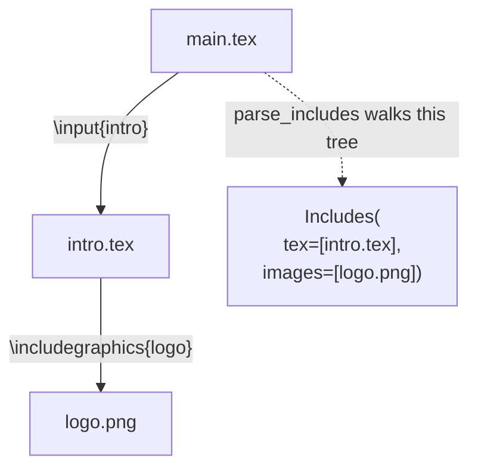

### 10.4 `flatten.py` - merging everything into one string

- `flatten(main_tex) -> str` - recursively expands `\input`/`\include` into a single
  LaTeX string. It uses a nested `expand(tex)` function that reads a file and runs a
  regex substitution: each include is replaced *inline* by the expanded text of the
  referenced file. Missing files raise `FileNotFoundError`.

> **Why is the include logic in two places?** `includes.py` and `flatten.py` both
> walk the include tree, but for different purposes: `includes.py` collects the
> *list* of files and images (so we know what to copy), while `flatten.py` produces
> the *merged text* (so the AI sees one self-contained document). Keeping them
> separate keeps each one simple. They are both called by the flatten node.

### 10.5 `overlays.py` - stripping Beamer animations

This enforces the **"no overlays in output"** rule before the AI ever sees the
content. It defines four regexes and applies them in order inside
`strip_overlays(text) -> str`:

1. `_UNWRAP_RE` - matches `\only<spec>{body}`, `\uncover<spec>{body}`,
   `\visible<spec>{body}`, `\onslide<spec>{body}` (with a non-nested body) and
   replaces them with just the `body`. The content is kept; the animation is
   dropped.
2. `_SWITCH_RE` - matches the bodiless switch form `\only<spec>` etc. and deletes
   it.
3. `_PAUSE_RE` - deletes `\pause`.
4. `_SPEC_RE` - deletes leftover overlay specs like `<1->` that hang off other
   commands (for example `\item<1->`).

The result is overlay-free LaTeX with all the actual content preserved.

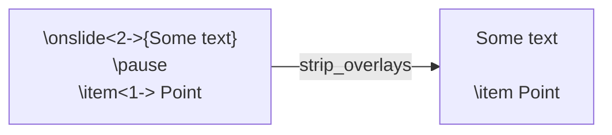

### 10.6 `aspect.py` - reading the slide aspect ratio

- `aspect_ratio(main_tex) -> str` - finds the `aspectratio=NNN` option in the
  beamer `\documentclass` and maps it to a Touying aspect-ratio string: `43` and a
  missing option both give `"4-3"`, `169` gives `"16-9"`, `1610` gives `"16-10"`,
  and so on for beamer's documented codes. Unknown codes fall back to `"4-3"`. The
  `detect_main` node calls this and stores the result, and the convert node passes
  it to the model so the generated Touying deck keeps the source deck's shape.
  Touying 0.7.3 accepts any `"W-H"` ratio, so the non-standard sizes still compile.

---

## 11. The Typst helpers

These three modules handle producing and compiling the output. They live at the top
level of the package (not under `latex/`) because they deal with the Typst side, not
the LaTeX side.

### 11.1 `typst_runner.py` - invoking the compiler

- `CompileResult` (dataclass) - holds `ok: bool`, `pdf_path: Path | None`,
  `error: str | None`.
- `typst_available() -> bool` - returns whether the `typst` binary is on `PATH` (via
  `shutil.which`). The integration tests use this to skip themselves when Typst is
  not installed.
- `compile_typst(typ_path) -> CompileResult` - runs `typst compile <typ_path>` using
  `subprocess.run(..., capture_output=True, text=True)`.
  - On return code 0 it reports success with the PDF path (the `.typ` path with a
    `.pdf` suffix).
  - On any other code it reports failure with the captured `stderr`.
  - If the `typst` binary is missing entirely, it catches the `FileNotFoundError`
    and returns a clear "install Typst" message instead of crashing.
  - It never raises, so the caller (the compile node) always gets a clean result
    object.

### 11.2 `typst_images.py` - fixing image references

- `_IMAGE_CALL_RE` - matches `image("...")` calls in Typst source.
- `fix_image_paths(typst_source, images) -> str` - the AI tends to mirror Beamer's
  extensionless `\includegraphics{logo}`, producing `image("logo")`, but Typst needs
  the real filename *with* extension (`image("logo.png")`). This function builds a
  lookup from each image's stem to its actual filename, then rewrites every
  `image("...")` call to the matching real filename. References it does not recognize
  are left untouched. Because `write_output` copies images flat into the output
  folder, these normalized basenames resolve correctly.

### 11.3 `typst_output.py` - removing a stray code fence

- `strip_code_fence(typst_source) -> str` - some models wrap their whole answer in a
  markdown code fence (```` ```typst ... ``` ````). This function detects when a
  fence wraps the *entire* output and removes it, returning the inner Typst. If no
  fence wraps the whole output, the source is returned unchanged - so genuine raw
  blocks inside the deck are left alone.

> **Why does this matter?** A leading ```` ``` ```` is actually valid Typst: it
> opens a raw (verbatim) block. So if the fence were left in, the deck would still
> compile, but into a PDF showing the literal source code as text. The compiler
> would never flag the mistake, which is exactly why we strip it deterministically
> instead of relying on the model to behave.

---

## 12. Logging (`log.py`)

- `setup_logging(log_dir=DEFAULT_LOG_DIR)` - configures
  [loguru](https://loguru.readthedocs.io) (the logging library) with two outputs
  ("sinks"):
  - **stderr at INFO level** - the high-level lines you see in the console.
  - **a rotating file at DEBUG level** (`logs/b2t.log`) - the full detailed trail.
- The file sink **rotates at 10 MB** and **keeps 10 days** of history, so logs never
  grow without bound.
- `enqueue=True` routes log writes through a queue, so the background job worker
  threads never block or interleave their output.
- `diagnose=False` makes tracebacks omit local variable values, so secrets like the
  API key can never leak into the log file.
- It calls `logger.remove()` first, clearing existing sinks, so calling it again is
  safe (no duplicated output).

---

## 13. Entry point B: the web app (`api/`)

The web layer wraps the same pipeline in a FastAPI server with a browser UI. It
adds: background execution (so the browser does not freeze during a conversion),
live progress tracking, an in-memory job store, per-node model and prompt-version
selection, prompt preview, a per-node state inspector, and an edit-and-recompile
loop. It lives in four Python files plus a static frontend.

> **This is a development and testing harness, not the end-user product.** It exists
> to exercise the pipeline and inspect output. A separate SaaS UI is a later roadmap
> item.

### 13.1 `api/jobs.py` - running jobs in the background

This module owns the job lifecycle.

- `PIPELINE_NODES` - a tuple naming the eight nodes in order, used as a reference for
  progress display.
- `EXECUTOR = ThreadPoolExecutor(max_workers=2)` - a module-level thread pool. Job
  conversions run here so HTTP requests can return immediately. At most two jobs run
  at once.
- `JobRecord` (dataclass) - everything tracked about one job: `id`, `status`,
  `current_node`, `error`, `input_dir`, `output_dir`, `main_tex`, `included_tex`,
  `images`, `has_typst`, `typst_path`, `pdf_path`, two AI-provenance maps
  (`llm_runs` = `{node: {model, prompt_version}}` and `llm_rendered` =
  `{node: {system, user}}`, the exact prompt each node sent), and two fields that
  feed the state inspector: `seed_state` (the JSON-safe pipeline seed) and
  `node_deltas` (a list of per-node `NodeDelta`s captured as each node finishes).
- `JobStore` - a thread-safe in-memory registry of jobs, guarded by a
  `threading.Lock` (the lock prevents two threads corrupting the data at once):
  - `create(**kwargs)` - makes a `JobRecord` with a random hex id, stores it,
    returns it.
  - `get(job_id)` - returns the record or `None`.
  - `update(job_id, **changes)` - applies field updates under the lock.
  - `append_delta(job_id, delta)` - appends one captured `NodeDelta` to the job's
    `node_deltas` under the lock (a list append the replace-style `update` cannot
    express).

  Because it is in-memory, **all jobs are lost when the server restarts.** That is
  acceptable for a local testing tool.

The job's status moves through a small set of states:

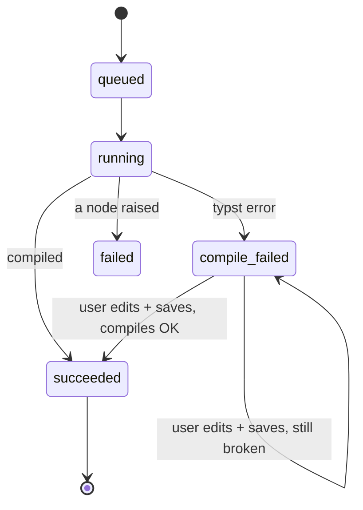

- `run_job(store, job_id, input_dir, output_dir, make_client, choices=None)` - the
  function the executor runs in the background. This is the bridge between the web
  layer and the graph:
  1. Seeds the graph input with the paths and `llm_choices` (from `choices`), sets
     status to `running`, and builds the graph. The client is built here, **inside
     the try/except**, via the `make_client` factory, so a missing API key records
     the job as `failed` instead of crashing the request handler.
  2. Serializes the seed once into `seed_state`, then calls
     `graph.stream(seed, stream_mode=["updates", "debug"])` and loops over the
     events. This is the key trick for live progress *and* live state capture:
     - **debug "task" events** fire when a node is *about to run*, so the code
       records `current_node` as the node that is actually executing (not the last
       one that finished).
     - **update events** carry each node's returned dict. Each is accumulated into a
       local `state` dict *and* turned into a `NodeDelta` (the node name, the fields
       it changed, and their JSON-safe values) appended to the job. Because this
       happens inside the loop, a node that later raises still leaves every earlier
       node's snapshot in place.
  3. If any node raises, it catches the exception, sets status `failed` with the
     message, and returns.
  4. After the run, it copies a summary into the job record: the main file name, the
     included file names, the image names, whether Typst was produced, the Typst
     path, and the AI provenance (`llm_runs`) and rendered prompts (`llm_rendered`),
     each flattened from the state objects into plain dicts.
  5. Finally it sets terminal status: `succeeded` with the PDF path if `compiled`,
     otherwise `compile_failed` with the compile error.

### 13.2 `api/schemas.py` - request and response shapes

Pydantic models that define the JSON the API accepts and returns. (Keeping these
separate from the internal `JobRecord` means the internal data and the public API
can evolve independently.)

- `NodeRunView` - `{model, prompt_version}`, one node's provenance.
- `JobCreated` - `{job_id, status}`, returned when a job is created.
- `JobView` - the full status payload the UI polls: `id`, `status`, `current_node`,
  `error`, `main_tex`, `included_tex`, `images`, `has_typst`, `has_pdf`, `llm_runs`
  (a map of `NodeRunView`), and `state_nodes` (the names of the nodes that have a
  captured snapshot, so the strip knows which boxes are clickable). **It deliberately
  does *not* include the large rendered prompts or the snapshot bodies** - those are
  served only on demand (see below), so the per-second poll stays small.
- `SaveRequest` - `{source}`, the edited Typst the user submits.
- `SaveResult` - `{ok, error}`, the recompile outcome.
- `ModelOption` / `ModelsView` - `{id, label}` entries and `{models, default}`, the
  model dropdown payload.
- `VersionOption` - `{id, label}`, one prompt-version dropdown entry.
- `LLMNodeView` / `LLMNodesView` - `{node, versions, default_version}` and the list
  of them, used to build the per-node UI controls.
- `GraphNode` / `GraphEdge` / `GraphView` - the pipeline topology as
  `{nodes: [{name, is_llm}], edges: [{source, target}]}`. (This replaced an earlier
  Mermaid-string shape; see section 14.)
- `PromptContentView` - `{node, version, description, system, user_template}`, a
  prompt version's raw content for the template preview.
- `RenderedPromptView` - `{node, model, prompt_version, system, user}`, the exact
  prompt a node sent on a specific job's run.
- `NodeStateView` - `{node, changed, state}`, one node's accumulated pipeline state
  (the `state` dict) plus the field names that node changed; the body the state
  inspector renders.
- `to_view(job) -> JobView` - converts an internal `JobRecord` into the external
  `JobView`, computing `has_pdf` by checking the PDF actually exists on disk, mapping
  `llm_runs` into `NodeRunView`s, and listing the captured node names in
  `state_nodes`.

### 13.3 `api/app.py` - the FastAPI app and endpoints

This is the web entry point. The module ends with `app = create_app()`, which is the
ASGI object the server (uvicorn) serves: `uvicorn b2t.api.app:app`.

Module constants:

- `SAMPLE_DECK` - path to the bundled test fixture deck (for one-click demos).
- `STATIC_DIR` - the `static/` folder.
- `FAKE_TYPST` - a tiny valid Typst document the fake client returns.

Helper functions:

- `_make_client(use_fake)` - returns a `FakeClient(FAKE_TYPST)` when offline mode is
  requested, otherwise an `OpenRouterClient()`.
- `_parse_choices(raw)` - parses and validates the per-node choices JSON from a form
  field. An unknown node or an unknown prompt version is rejected with HTTP 400
  before the job starts; an unknown *model* is allowed through (OpenRouter may accept
  models not in the curated catalog).
- `_safe_target(root, rel)` - resolves an uploaded relative path under `root` and
  raises HTTP 400 if it escapes `root`. This is a **path-traversal guard**: it stops
  a malicious upload named `../../etc/passwd` from writing outside the intended
  folder.
- `_reconstruct(files, root)` - rebuilds an uploaded folder tree on disk, writing
  each uploaded file to its safe target path.
- `_zip_dir(directory)` - zips every file under a directory into a fresh temp zip
  (used by the download endpoint).

`create_app(store=None) -> FastAPI` - builds the app, loads `.env`, turns on
logging, creates (or accepts) a `JobStore`, and registers the routes. Accepting an
optional `store` is what lets tests inject their own job store. The routes:

| Method + path                       | Handler              | What it does                                                                                                                                |
| ----------------------------------- | -------------------- | ------------------------------------------------------------------------------------------------------------------------------------------- |
| `POST /api/jobs`                    | `create_job`         | Reconstructs the uploaded folder, validates the optional per-node `choices`, creates a job, submits `run_job`. Rejects empty uploads with 400. |
| `POST /api/jobs/sample`             | `create_sample_job`  | Same, but runs the bundled sample deck.                                                                                                     |
| `GET /api/jobs/{id}`                | `get_job`            | Returns the `JobView` (404 if unknown). The UI polls this once a second.                                                                    |
| `GET /api/jobs/{id}/typ`            | `get_typ`            | Returns the generated Typst source as plain text.                                                                                          |
| `GET /api/jobs/{id}/pdf`            | `get_pdf`            | Returns the compiled PDF file.                                                                                                              |
| `POST /api/jobs/{id}/save`          | `save_job`           | Writes edited Typst back, recompiles, updates status, and on failure deletes the stale PDF so a later download stays consistent.            |
| `GET /api/jobs/{id}/download`       | `download_job`       | Zips the output folder and returns it as `deck.zip`.                                                                                        |
| `GET /api/jobs/{id}/prompt/{node}`  | `get_rendered_prompt`| Returns the exact prompt that node sent on this job's run (404 before a run, or for an unknown node).                                       |
| `GET /api/jobs/{id}/state/{node}`   | `get_node_state`     | Returns the accumulated pipeline state after `node` ran (the snapshot the inspector shows), folded on demand from the seed and the per-node deltas; 404 before that node has run. |
| `GET /api/models`                   | `get_models`         | Returns the model list and default for the dropdown.                                                                                       |
| `GET /api/llm-nodes`                | `get_llm_nodes`      | Returns each AI node with its prompt versions and default version (drives the per-node UI controls).                                        |
| `GET /api/prompts/{node}/{version}` | `get_prompt_content` | Returns a prompt version's `system` and `user_template` (404 for unknown node/version). The template preview.                              |
| `GET /api/graph`                    | `get_graph`          | Returns the pipeline topology (`nodes` with `is_llm`, plus `edges`), derived from the real compiled graph.                                  |

The last line, `app.mount("/", StaticFiles(directory=STATIC_DIR, html=True))`,
serves the browser UI at the root URL.

> **Nice detail:** `/api/graph` derives its node list from
> `build_graph(FakeClient()).get_graph()` (dropping the `__start__`/`__end__`
> pseudo-nodes) and marks a node `is_llm` when its name is in the prompt registry
> (`prompts.list_nodes()`). So the diagram the browser draws is generated *from the
> real graph*, and the "which nodes get AI controls" decision can never drift from
> the actual pipeline.

### 13.4 `api/state_view.py` - serializing and folding pipeline state

The state inspector needs two things: to turn the live `PipelineState` (full of
`Path`s and Pydantic submodels) into something a browser can show, and to
reconstruct "the state as of node N" on demand. This small module does both, and it
imports nothing from the rest of the web layer, so it cannot create an import cycle.

- `to_jsonsafe(value)` - recursively converts one state value to a JSON-safe form: a
  `Path` becomes a string, a Pydantic model becomes a dict (via `model_dump`), lists
  and dicts recurse, primitives pass through, and anything unexpected is stringified
  rather than crashing a debug tool.
- `serialize_values(d)` - applies `to_jsonsafe` to every value of a dict; used for
  both a node's delta and the seed.
- `NodeDelta` (dataclass) - one node's contribution to the state: `node` (its name),
  `changed` (the field names it wrote), and `values` (those values, already
  JSON-safe).
- `fold_snapshot(seed_state, deltas, node)` - rebuilds the accumulated snapshot by
  starting from the seed and applying each delta's values in order up to and
  including the named node, returning that node's `changed` list and the full state
  dict. It raises `KeyError` (which the endpoint turns into a 404) if the node has
  not run.

`run_job` does the capturing (it calls `serialize_values` and builds `NodeDelta`s);
the `/state/{node}` endpoint does the serving (it calls `fold_snapshot`). Storing
per-node *deltas* rather than full snapshots keeps each field value once and makes
the "what changed here" highlight free, while the fold reconstructs the full state
cheaply when a node is clicked.

---

## 14. The browser UI (`api/static/`)

A single page, no framework. Three files. The headline feature: the pipeline graph
is **rendered by our own code** (not by a diagram library), so each AI node can
carry inline controls and a prompt preview.

### 14.1 `index.html`

The page skeleton. Three sections:

- **Submit**: a folder picker (`<input webkitdirectory>`), a "use fake converter
  (offline)" checkbox, and "Convert folder" / "Use sample deck" buttons.
- **Status**: a status badge, a `#graph` container for the custom pipeline strip, a
  `#graph-hint` line telling the user to click a node to inspect its state, a hidden
  `#state-inspector` panel that holds the per-node state view, a `#llm-nodes`
  container for the per-AI-node control cards, and a `#provenance` line.
- **Output**: a `<textarea id="typ">` that becomes the code editor, "Save and
  compile" / "Download" buttons, a PDF `<iframe>`, and an error `<pre>`.

It loads **CodeMirror** (the code editor) from a CDN. There is no diagram library:
the pipeline graph is drawn by `app.js` from plain HTML. Finally it loads `app.js`.

### 14.2 `app.js`

The client logic, plain JavaScript. Key pieces:

- It registers a small CodeMirror "simple mode" for Typst syntax highlighting and
  turns the `#typ` textarea into an editor. `getSource()` / `setSource()` wrap the
  editor so the rest of the code does not care whether CodeMirror loaded.
- `loadGraph()` - fetches `/api/graph`, then builds the **pipeline strip**: one
  small `<div class="node">` per node (with an arrow between them), marking AI nodes
  with a `llm` class. It stores a name-to-element map and the node order for
  highlighting. On any fetch failure it falls back to a plain-text stage line.
- `highlightGraph(currentNode, status)` - colors each node box `done`, `active`, or
  `pending` based on where the pipeline is (the CSS animates the active one).
- `loadLLMNodes()` - fetches `/api/models` and `/api/llm-nodes` and builds one
  **card** per AI node into `#llm-nodes` via `buildCard`.
- `buildCard(node)` - a card stacking, one per line, a model dropdown
  (`.model-select`, labelled "model"), a prompt-version dropdown (`.version-select`,
  labelled "prompt version", default selected), and a "view prompt" toggle button.
  The dropdowns carry `data-node` so the submit path can read them.
- `buildPreview(node, getVersion)` - the inline, read-only prompt preview that the
  toggle expands. It has two tabs: **template** (fetches
  `/api/prompts/{node}/{version}` and shows the raw `system` and `user_template`
  with the `{{tokens}}` literal, available any time) and **rendered** (fetches
  `/api/jobs/{currentJobId}/prompt/{node}` and shows the exact prompt sent on the
  last run, labelled "as run: model, version"; before any run it shows a hint to run
  the pipeline first). Changing the version dropdown re-fetches the template view.
- `collectChoices()` - gathers the per-node dropdowns into a `{node: {model,
  prompt_version}}` object; `commonFields()` attaches that JSON plus the "use fake"
  flag to each submission.
- `poll(id)` - the polling loop. It fetches `/api/jobs/{id}` every second, updates
  the badge and graph, and when the status is terminal (`succeeded`,
  `compile_failed`, or `failed`) calls `finish`.
- `finish(id, job)` - loads the generated Typst into the editor, points the PDF
  iframe at the PDF endpoint (with a cache-busting timestamp), shows any error,
  enables the Save and Download buttons, and writes the provenance line ("Ran:
  convert (model, version)").
- **The state inspector** (a cluster of small functions). After each poll,
  `markInspectable()` adds an `inspectable` class to the strip boxes whose names are
  in the job's `state_nodes`, so only nodes that have run look clickable. Clicking a
  node calls `inspectNode(node)`, which toggles the panel shut if that node is
  already shown, otherwise fetches `/api/jobs/{id}/state/{node}` and renders it.
  `ensureInspector()` builds the panel shell once (a header with a `hide` button, a
  `changed:` line, and an `#inspector-viewer`). `setViewer(text)` puts the
  pretty-printed JSON into the viewer through `highlightJson(text)`, a tiny
  highlighter that HTML-escapes first (so deck or model text can never inject markup)
  and wraps JSON tokens in coloured spans; the viewer is a plain element that scrolls
  natively, so any snapshot size reaches the bottom. `selectNode`/`hideInspector`
  manage the selected-node outline, and starting a new run hides the panel.
- Button handlers: "Convert folder" gathers the picked files (with their relative
  paths) and POSTs to `/api/jobs`; "Use sample deck" POSTs to `/api/jobs/sample`;
  "Save and compile" POSTs the edited source to `/save` and refreshes the PDF;
  "Download" navigates to the download endpoint.

### 14.3 `style.css`

Plain styling. The notable parts are: the `#graph .node.done/.active/.pending` rules
that color the custom strip boxes by pipeline state (green = done, amber = active,
grey = pending), a pulse animation for the active node, a dashed accent for AI
(`.node.llm`) nodes, the `.llm-card` / `.prompt-preview` / `.preview-tabs` rules for
the per-node control cards and the inline prompt preview, and the state-inspector
rules: `#graph .node.inspectable` (pointer cursor) and `.node.selected` (outline) on
the strip, `#inspector-viewer` (the dark, capped-height, natively-scrolling JSON
box), and the `.json-key` / `.json-string` / `.json-number` / `.json-boolean` /
`.json-null` token colours. The badge colors also change with status (amber while
running, green on success, red on failure).

---

## 15. End-to-end traces

Putting it all together, here is what actually happens on a run.

### 15.1 Library run

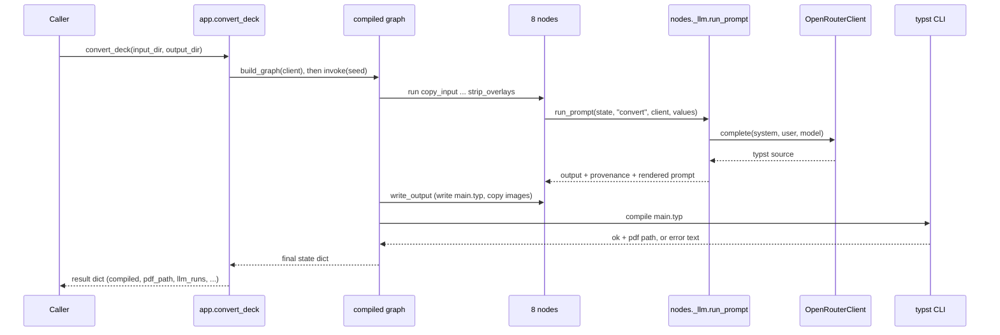

### 15.2 Web run

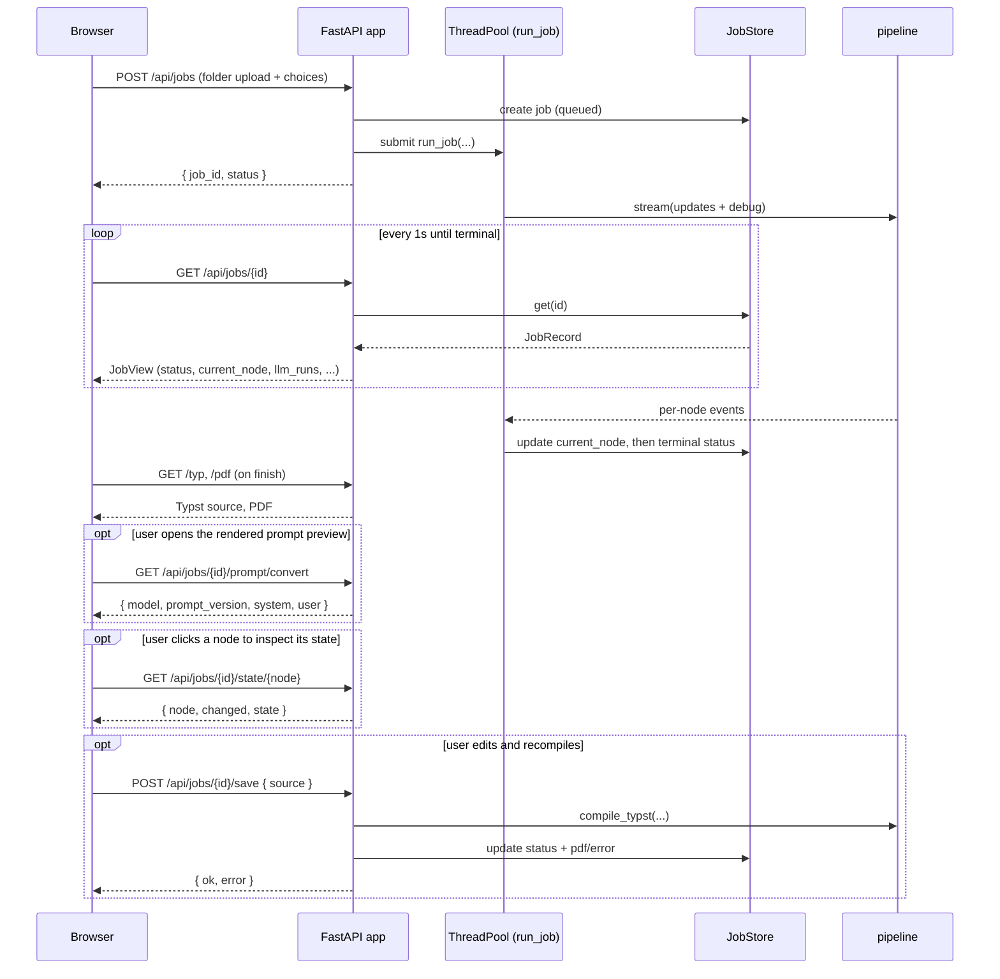

---

## 16. The tests (`tests/`)

The suite has **160 tests** across 21 files, one test module per source module, and
it runs in a few seconds. `conftest.py` provides a `deck_copy` fixture: a writable
copy of the sample deck in a temp directory, so tests never mutate the fixture
itself.

Coverage by area:

- **Deterministic helpers** each have focused unit tests (`test_cleanup`,
  `test_detect`, `test_includes`, `test_flatten`, `test_overlays`,
  `test_typst_images`, `test_typst_output`).
- **Nodes and graph**: `test_nodes` exercises the node functions, and `test_graph`
  runs the whole pipeline with the fake client.
- **The LLM seam**: `test_llm` checks the client interface and the fake;
  `test_prompts` covers prompt discovery, default resolution, loading, and the
  brace-and-`$`-heavy rendering case; `test_llm_node` covers the shared `run_prompt`
  helper (model/version resolution and the returned provenance and rendered prompt).
- **Config and logging**: `test_config`, `test_state`, `test_log`.
- **The web layer** has the most tests: `test_api_app`, plus `test_api_jobs` and
  `test_api_schemas` (including the structured `/api/graph`, the template and
  rendered prompt endpoints, the `choices` validation paths, the guard that the large
  rendered prompt never enters `JobView`, and the state inspector: the
  `/api/jobs/{id}/state/{node}` endpoint, the `state_nodes` poll field, and the
  capture of per-node deltas in `run_job`, including the partial set left after a
  mid-pipeline failure).
- **The state-inspector helper** has its own module, `test_state_view`: `to_jsonsafe`
  over paths, lists, and Pydantic submodels, and `fold_snapshot`'s ordering and
  `changed` result.
- **Typst-touching tests** are marked `integration` and only run when the `typst`
  binary is present (`pytest -m "not integration"` skips them). On a machine with
  Typst 0.14+ installed they run and pass too.

The sample deck (`tests/fixtures/sample_deck/`) is a minimal but representative
Beamer deck: `main.tex` sets up the title and `\input`s `intro.tex`, which has
bullet-list slides, an equation slide (the quadratic formula and `E = mc^2`), and a
slide with an included `logo.png`. It deliberately ships with leftover build files
(`main.aux`, `main.log`, `main.nav`, ...) so the cleanup step has something real to
remove.

> **The test philosophy in one line:** the fake client means the entire pipeline can
> be tested end-to-end without ever calling a paid AI or touching the network. The
> AI is the only non-deterministic part, and it is isolated behind one swappable
> interface precisely so the rest can be tested cheaply.

---

## 17. Continuous integration (`.github/workflows/`)

`ci.yml` defines a **GitHub Actions** workflow that runs the test suite
automatically. It triggers on every push to `main` and on every pull request, and a
`concurrency` group cancels a superseded run when you push again quickly.

The single `test` job runs on `ubuntu-latest` and does five things:

1. `actions/checkout@v5` - check out the repository.
2. `astral-sh/setup-uv` (with caching) - install uv and cache its download store
   between runs.
3. `typst-community/setup-typst` pinned to **0.14.2** - install the Typst CLI, so
   the `integration` tests (the real `typst compile` path) actually run in CI rather
   than skipping.
4. `uv sync --locked` - install dependencies exactly as pinned in `uv.lock`,
   failing if the lockfile is out of date.
5. `uv run pytest -v` - run the full suite.

> **No secrets needed.** The whole suite runs offline through `FakeClient` (one test
> even asserts that a real run without `OPENROUTER_API_KEY` fails gracefully), so the
> workflow needs nothing configured in GitHub secrets. The Typst version is pinned
> exactly to match local development, in keeping with the project's "deterministic
> first" ethos (it pins every Typst package version too).

---

## 18. How to run it yourself

You need [uv](https://docs.astral.sh/uv/) (which manages Python and dependencies)
and, for real compiles, the [Typst CLI](https://github.com/typst/typst) 0.14+ on
your PATH. No LaTeX is needed.

```bash
# install dependencies
uv sync

# run the test suite (integration tests skip if typst is absent)
uv run pytest

# convert the sample deck as a library call
uv run python -c "from b2t.app import convert_deck; convert_deck('tests/fixtures/sample_deck', 'out')"

# or start the web UI, then open http://127.0.0.1:8000
uv run uvicorn b2t.api.app:app --reload
```

In the web UI you can pick a deck folder (or click "Use sample deck"), and for each
AI node choose a model and a prompt version and preview the exact prompt. Tick "use
fake converter (offline)" to exercise the pipeline without calling OpenRouter.

For real (non-fake) conversions, create a `.env` file in the repo root with
`OPENROUTER_API_KEY=sk-or-...` (and optionally `B2T_MODEL=...` or `B2T_BASE_URL=...`).
Without it, you can still exercise everything using the fake client (the test suite,
and the "use fake converter" checkbox in the UI).

---

## 19. Glossary

- **ASGI** - the standard interface between a Python web app and the web server that
  runs it. `app = create_app()` produces the ASGI object uvicorn serves.
- **Beamer** - the LaTeX package for making slide decks. The input format.
- **CDN** - "Content Delivery Network"; here, where the browser loads CodeMirror
  from, instead of bundling it.
- **CI / GitHub Actions** - "continuous integration": a server that runs the test
  suite automatically on every push and pull request. See section 17.
- **Dataclass** - a lightweight Python class for holding data, declared with the
  `@dataclass` decorator.
- **Deterministic** - same input always gives the same output; no AI, no randomness.
- **Fixture** - in testing, a known starting setup (here, a copy of the sample deck)
  prepared before each test.
- **LangGraph** - the library used to define the pipeline as a graph of nodes over a
  shared state object.
- **LLM** - Large Language Model; the AI that does the Beamer-to-Typst translation.
- **Node** - one step in the pipeline; here, a small Python function that reads and
  writes the shared state.
- **OpenRouter** - a service exposing many AI models behind a single
  OpenAI-compatible API.
- **Overlay** - a Beamer step-by-step reveal animation (`\pause`, `\only`, ...);
  always removed in b2t's output.
- **`partial`** - `functools.partial`, which pre-fills some arguments of a function.
  Used to bind the AI client into the `convert` node.
- **Prompt registry** - the versioned prompt files under `prompts/`, one folder per
  AI node, loaded by `prompts.py`. See section 7.2.
- **Prompt version** - one specific prompt for a node (a `system` instruction plus a
  `user_template`), stored as a single `.toml` file (e.g. `convert/v1.toml`).
- **Protocol** - a Python typing feature describing "any object with these methods",
  used to make the AI client (`LLMClient`) swappable.
- **Provenance** - the record of what actually ran: the model and prompt version each
  AI node used (`llm_runs`), and the exact prompt it sent (`llm_rendered`).
- **Pydantic** - the library for typed, self-validating data models (`PipelineState`,
  the API schemas).
- **Regex** - "regular expression", a pattern for matching text; used heavily in the
  LaTeX helpers.
- **State** - the single `PipelineState` object threaded through every node.
- **TOML** - a simple, readable config file format; each prompt version is one TOML
  file, read with Python's built-in `tomllib`.
- **Touying** - the Typst package for slide decks. The output format.
- **Typst** - a modern typesetting system; the output language. Its compiler is the
  final judge of success.
- **uv** - the tool that manages Python versions and dependencies for this project.
  Always run via `uv run ...`.

---

## 20. Where to start reading the source

If you want to read the code in the order it executes, follow this path:

1. `state.py` (the data) and `config.py` (the constants).
2. `app.py` (the library entry point) to see the whole run in one function.
3. `graph.py` to see the node order.
4. `nodes/` in pipeline order, jumping into each `latex/` helper as you reach it.
5. The LLM seam, in this order: `llm.py` (the client), `prompts.py` plus
   `prompts/convert/v1.toml` (the wording), then `nodes/_llm.py` (the glue) and
   `nodes/convert.py` (the one AI node that uses them).
6. `typst_runner.py`, `typst_images.py`, and `typst_output.py` for the output and
   compile steps.
7. `log.py` for how logging is wired.
8. `api/jobs.py`, `api/state_view.py`, then `api/app.py`, then `static/app.js` for
   the web layer.

### The five ideas that hold it together

- **Two entry points, one pipeline.** `app.convert_deck` (library) and
  `api.app.create_app` (web, via `run_job`) both call `graph.build_graph` and run the
  same eight nodes.
- **One state object.** `PipelineState` flows through every node; the field order in
  `state.py` mirrors the pipeline order, and the AI selection/provenance fields ride
  along with it.
- **Thin nodes, real logic in helpers.** Each `nodes/*` function is a small adapter
  over a `latex/*`, `nodes/_llm`, `typst_runner`, `typst_images`, or `typst_output`
  function, where the testable logic lives.
- **One isolated, versioned AI call.** Only `convert` touches a model, and only
  through the `LLMClient` Protocol and the prompt registry, so `FakeClient` can stand
  in for tests and offline use, the wording is versioned in git, and what ran is
  recorded as provenance.
- **The compiler is the judge.** `compile_typst` decides success or failure; failures
  are recorded as data, surfaced to the user, and (in the web UI) fixable by hand and
  recompilable - with no automatic AI retry loop yet.
