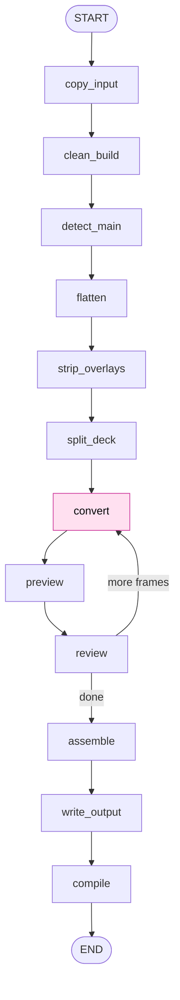

# b2t

An AI-powered conversion pipeline that turns compiled LaTeX Beamer decks into
accessible Typst Touying PDFs. A deterministic LangGraph workflow does
everything that does not need a model; one LLM step, served by open-source
models (gpt-oss, Llama, Qwen, Gemma, Mistral) via OpenRouter, performs the
Beamer to Typst translation. Built for university faculty, with PDF/UA-1
tagging for blind and visually impaired readers as the driving goal.

## Contents

- [Architecture (v0)](#architecture-v0)
  - [Nodes](#nodes)
- [Models](#models)
- [Getting started](#getting-started)
  - [Requirements](#requirements)
  - [Setup](#setup)
  - [Verify](#verify)
- [Run (v0)](#run-v0)
- [Run the testing UI](#run-the-testing-ui)
- [Logs](#logs)
- [License](#license)

## Architecture (v0)

The pipeline is a LangGraph `StateGraph` over a single Pydantic
`PipelineState`, with a per-frame `convert -> preview -> review` cycle.
Everything that can be done without an LLM is done in plain Python; the one LLM
step translates the deck one Beamer frame at a time. The Typst compiler is the
final arbiter of success.



The shaded `convert` node is the only LLM step; it runs once per Beamer frame in
a cycle, followed by `preview` and `review`. Every other node is deterministic.
With per-frame review enabled (the testing UI's "review each frame" toggle), the
`review` node pauses the graph after each frame so a reviewer can approve it or
send feedback for regeneration; with review off, frames are accepted
automatically and the pipeline behaves exactly as before.

### Nodes

1. `copy_input` (deterministic): Copies the read-only input deck into a fresh
   temporary working directory so the original is never mutated.
2. `clean_build` (deterministic): Deletes LaTeX build artifacts (`.aux`,
   `.log`, `.nav`, `.toc`, `.synctex.gz`, and similar) from the working copy.
3. `detect_main` (deterministic): Finds the single `.tex` that declares a
   Beamer document (`\documentclass`, `beamer`, `\begin{document}`). Fails
   loudly unless exactly one is found, and reads its `aspectratio` option so the
   output keeps the source's shape (4:3, 16:9, 16:10, ...).
4. `flatten` (deterministic): Parses the include graph (`\input`, `\include`,
   `\includegraphics`), records referenced image files, and expands every
   include into one LaTeX string.
5. `strip_overlays` (deterministic): Removes Beamer overlay constructs
   (`\pause`, `\only`, `\uncover`, `\onslide`, and `<...>` specs) while keeping
   the wrapped content. The output never uses overlays.
6. `split_deck` (deterministic): Splits the stripped source into the preamble,
   the title metadata (`\title`, `\author`, `\subtitle`, `\institute`,
   `\date`), an ordered list of frames each tagged with its `\section`, a
   table-of-contents flag, and the detected `.bib`. The title-slide, outline,
   and bibliography frames are excluded because the scaffold renders them.
   Frames after `\appendix` are tagged as appendix material and a starred
   `\section*` is flagged, so the assembler can keep their headings out of the
   outline.
7. `convert` (LLM): The only model call, run once per frame in a graph cycle.
   Each invocation translates one Beamer frame into a `==` frame-title heading
   plus body (the `candidate`), using the preamble, the reference presentation,
   the Typst math guide, and any reviewer feedback as context. A wrapping
   markdown code fence is stripped deterministically.
8. `preview` (deterministic): With review enabled, assembles the deck so far
   (header plus already-approved frames plus the candidate, with the bibliography
   and thank-you slide when the deck has a `.bib` so citation frames resolve),
   normalizes image paths, copies the images and `.bib` next to it, and compiles
   it to `preview.pdf` so the reviewer sees the new frame in context. A no-op
   when review is off.
9. `review`: With review off, commits the candidate and advances. With review
   on, pauses the graph (a LangGraph interrupt) until the reviewer approves (the
   frame is committed) or regenerates with feedback (the same frame is redone).
10. `assemble` (deterministic): Builds the final deck: the header (imports,
   theme, `config-info` from the metadata, title slide), an optional outline,
   the converted frame bodies interleaved with `= Section` headings, and an
   optional bibliography plus thank-you slide. Appendix frames are rendered
   after the bibliography, introduced by `#show: appendix`, with their section
   and frame headings labelled `<touying:hidden>` so they stay out of the
   table of contents; a `= Appendix` wrapper is synthesized when the source
   appendix has no section of its own.
11. `write_output` (deterministic): Normalizes `image()` references to the
   copied filenames (with extension), writes `main.typ` to the output
   directory, and copies the referenced images and the `.bib` alongside it.
12. `compile` (deterministic): Runs `typst compile` on `main.typ` and records
    the result (PDF path on success, error text on failure); failures are
    recorded, not yet retried.

## Models

Conversions use open-weight LLMs only, so a university can later self-host the
same families on its own cluster behind any OpenAI-compatible endpoint (vLLM,
Ollama). The catalog in `src/b2t/config.py` lists the strongest open-weight
flagship of each family (Qwen 3.5 397B, Mistral Large 3, Llama 4 Maverick,
Gemma 4 31B) plus the sizes campuses most commonly self-host. The testing UI
shows each model's complexity, strength, and reasoning level in each node's
model dropdown; the default is `openai/gpt-oss-120b`.

## Getting started

### Requirements

- [uv](https://docs.astral.sh/uv/getting-started/installation/): manages
  Python and all dependencies. Python 3.12 is fetched automatically if needed.
- [Typst CLI](https://github.com/typst/typst#installation) 0.14+ on PATH
  (`winget install Typst.Typst`, `brew install typst`, or
  `cargo install typst-cli`). Verify with `typst --version`.
- An OpenRouter API key, for real conversions. The pipeline runs offline with
  the fake converter (tests and the UI checkbox), but actual Beamer to Typst
  translation calls open-source models via OpenRouter.

No LaTeX installation is needed; input decks are already compiled.

### Setup

```bash
git clone https://github.com/SushrutGaikwad/b2t.git
cd b2t
uv sync
```

Create a `.env` file in the repo root:

```
OPENROUTER_API_KEY=sk-or-...
```

Optionally add `B2T_MODEL=...` to override the default model
(`openai/gpt-oss-120b`), or `B2T_BASE_URL=...` to point at any
OpenAI-compatible endpoint (for example a campus vLLM server).

### Verify

```bash
uv run pytest
```

All tests should pass. Typst integration tests are skipped unless the `typst`
CLI is installed.

## Run (v0)

```bash
uv run python -c "from b2t.app import convert_deck; convert_deck('tests/fixtures/sample_decks/deck1', 'out')"
```

Output is written to `out/` (`main.typ`, copied images, and `main.pdf` on
success).

## Run the testing UI

A thin browser UI for converting a deck folder and inspecting the result.

> This UI is for local development and testing only. It is a harness for
> exercising the pipeline and inspecting output, not the end-user product. A
> separate SaaS UI will be built later once the pipeline matures (see the
> roadmap in `CLAUDE.md`).

```bash
uv run uvicorn b2t.api.app:app --reload
```

Open http://127.0.0.1:8000. Pick a bundled sample deck from the dropdown and
click "Use sample deck" for a one-click run, or pick your own deck folder with
the folder chooser. For each LLM node you can choose a
model and a prompt version; tick "use fake converter (offline)" to exercise the
pipeline without calling OpenRouter. The page shows per-node progress, the
model and prompt version each node used, the generated `main.typ` in an editor
(save to recompile), the compiled PDF, and any compile error. Click any pipeline
node to inspect the LangGraph state captured after that step (the accumulated
state, with the fields that node changed highlighted).

Tick "review each frame" to convert one frame at a time: the run pauses after
each frame and a review panel shows the candidate Typst and a compiled preview
of the deck so far. Approve to accept the frame and move on, or type feedback
and Regenerate to redo just that frame. A paused review lives in the server's
memory, so it survives until the dev server stops (durable persistence across
restarts is a later, SaaS-stage concern).

## Logs

The console shows INFO lines; the full DEBUG trail is written to
`logs/b2t.log` (rotated at 10 MB, kept 10 days, gitignored). Tracebacks omit
variable values so API keys never land in the logs.

## License

Licensed under the Apache License, Version 2.0. See [LICENSE](LICENSE) for the
full text.

---

Keywords: AI document conversion, LLM pipeline, LangGraph, generative AI,
open-source LLM, OpenRouter, gpt-oss, Llama, Qwen, Gemma, Mistral, vLLM,
Typst, Touying, LaTeX, Beamer, accessible PDF, PDF/UA, screen reader,
document accessibility, higher education.
