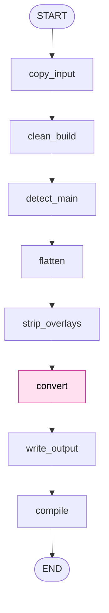

# b2t

Converts compiled LaTeX Beamer decks into accessible Typst Touying PDFs.

## Architecture (v0)

The pipeline is a linear LangGraph `StateGraph` over a single Pydantic
`PipelineState`. Everything that can be done without an LLM is done in plain
Python; the one LLM call handles only the Beamer to Touying translation. The
Typst compiler is the final arbiter of success.



The shaded `convert` node is the only LLM step; every other node is
deterministic.

### Nodes

1. `copy_input` (deterministic): Copies the read-only input deck into a fresh
   temporary working directory so the original is never mutated.
2. `clean_build` (deterministic): Deletes LaTeX build artifacts (`.aux`,
   `.log`, `.nav`, `.toc`, `.synctex.gz`, and similar) from the working copy.
3. `detect_main` (deterministic): Finds the single `.tex` that declares a
   Beamer document (`\documentclass`, `beamer`, `\begin{document}`). Fails
   loudly unless exactly one is found.
4. `flatten` (deterministic): Parses the include graph (`\input`, `\include`,
   `\includegraphics`), records referenced image files, and expands every
   include into one LaTeX string.
5. `strip_overlays` (deterministic): Removes Beamer overlay constructs
   (`\pause`, `\only`, `\uncover`, `\onslide`, and `<...>` specs) while keeping
   the wrapped content. The output never uses overlays.
6. `convert` (LLM): The single model call. Translates the flattened,
   overlay-free Beamer source into Typst Touying source, using the reference
   presentation and the Typst math guide as context.
7. `write_output` (deterministic): Normalizes `image()` references to the
   copied filenames (with extension), writes `main.typ` to the output
   directory, and copies the referenced images alongside it.
8. `compile` (deterministic): Runs `typst compile` on `main.typ` and records
   the result (PDF path on success, error text on failure). v0 records the
   error but does not yet retry.

## Develop

```bash
uv run pytest
```

Typst integration tests are skipped unless the `typst` CLI is installed.

## Run (v0)

Requires `OPENAI_API_KEY` in `.env` and the `typst` CLI on PATH.

```bash
uv run python -c "from b2t.app import convert_deck; convert_deck('tests/fixtures/sample_deck', 'out')"
```

Output is written to `out/` (`main.typ`, copied images, and `main.pdf` on
success). Set `OPENAI_MODEL` to override the default model.

## Run the testing UI

A thin browser UI for converting a deck folder and inspecting the result.

```bash
uv run uvicorn b2t.api.app:app --reload
```

Open http://127.0.0.1:8000. Click "Use sample deck" for a one-click run, or
pick a deck folder with the folder chooser. Tick "use fake converter (offline)"
to exercise the pipeline without calling OpenAI. The page shows per-node
progress, the generated `main.typ`, the compiled PDF, and any compile error.

A real conversion needs `OPENAI_API_KEY` in `.env` and the `typst` CLI on PATH.
