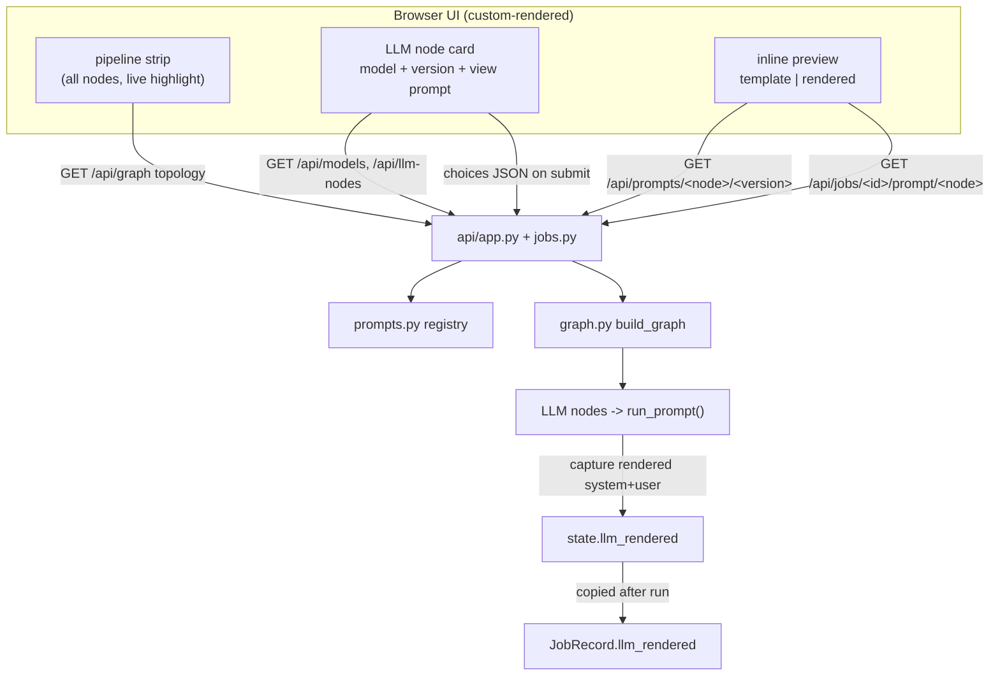
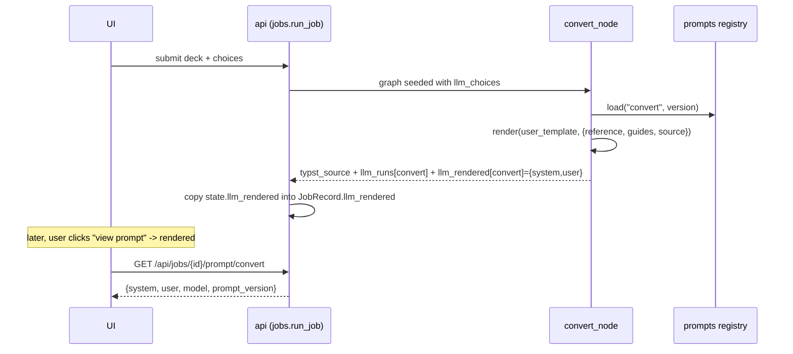

# Graph-Rendered Per-Node Prompt Selection and Preview - Design

Date: 2026-06-10
Status: proposed

## 1. Motivation

Today the testing UI shows the pipeline two ways that are disconnected from each
other:

- The `#graph` panel renders whatever Mermaid string LangGraph emits
  (`/api/graph` returns `build_graph(...).get_graph().draw_mermaid()`), used only
  for live progress highlighting.
- A separate `#llm-nodes` block above the graph holds the per-node model and
  prompt-version dropdowns.

We want the controls to live on the graph itself: each LLM node in the rendered
pipeline should carry its own model and prompt-version pickers, plus a way to see
exactly what the selected prompt is. Mermaid SVG cannot host interactive
controls, so the pipeline graph will be rendered by our own frontend code instead
of by LangGraph's Mermaid output. The topology is still derived from the real
compiled graph, so the diagram cannot drift from the actual pipeline.

This builds directly on the prompt-versioning work (see
`2026-06-10-prompt-versioning-design.md`): the registry, per-node selection, and
provenance already exist. This change is mostly a frontend rework plus two small
read-only endpoints to serve prompt content.

## 2. Scope

In scope:

- Replace the Mermaid-rendered graph with a frontend-rendered pipeline strip,
  built from a new structured topology endpoint, that keeps the existing live
  progress highlighting (done / active / pending).
- Move the per-node model and prompt-version pickers onto the LLM nodes, rendered
  as a card beneath the strip (one card per LLM node; only `convert` today).
- A read-only prompt preview per LLM node with a toggle between two views:
  - template: the version's `system` instruction and `user_template` with
    `{{reference}}`, `{{guides}}`, `{{source}}` tokens shown literally; available
    at any time.
  - rendered: the exact `system` and `user` message that was sent in the most
    recent run of that node; available only after a run.
- Two new read-only endpoints to serve template content and rendered content.
- Capture the rendered prompt at run time so the rendered view is ground truth,
  not a reconstruction.
- Remove the Mermaid dependency (CDN import and `mermaid-ready` wiring) and the
  old `#llm-nodes` block.

Out of scope (unchanged from the prompt-versioning design):

- Editing or authoring prompts in the UI. The preview is read-only.
- Running one deck through multiple prompt versions for side-by-side comparison.
- Rendering an arbitrary version selection without a run (would require faking a
  deck source). The rendered view reflects what actually ran.
- Persisting anything beyond the in-memory job record.

## 3. Decisions already made (with rationale)

| Decision | Choice | Why |
| --- | --- | --- |
| Graph rendering | Frontend renders a custom strip; topology from a structured endpoint derived from the real graph | Mermaid cannot host controls; deriving topology keeps the diagram from drifting from the pipeline |
| What the strip shows | All pipeline nodes, with live highlighting; LLM nodes additionally get a control card | Matches the approved mockup and keeps the existing progress view |
| Preview content | Both template and rendered, toggled | User selection |
| Preview placement | Inline, expandable beneath the node card | User selection |
| Preview editability | Read-only | Consistent with the prior "no UI prompt editing" decision |
| Rendered source | Captured at run time and served lazily; tied to the most recent run | Truthful (it is exactly what was sent) and generic across future LLM nodes |
| Endpoint shape | Dedicated lazy endpoints for template and rendered content | The polled `JobView` (hit every second) must not carry large prompt strings |

## 4. Architecture overview



The template view reads static registry files; the rendered view reads what the
last run actually sent. Both previews are lazy: nothing is fetched until the user
opens a preview.

## 5. Components

### 5.1 Structured topology endpoint (`src/b2t/api/app.py`, `schemas.py`)

Replace the Mermaid payload with a structured one derived from the real compiled
graph, so the frontend can render nodes and connectors and know which nodes are
LLM nodes.

`GET /api/graph` -> `GraphView`:

```python
class GraphNode(BaseModel):
    name: str
    is_llm: bool

class GraphEdge(BaseModel):
    source: str
    target: str

class GraphView(BaseModel):
    nodes: list[GraphNode]
    edges: list[GraphEdge]
```

Derivation:

- Build a throwaway graph: `build_graph(FakeClient()).get_graph()`.
- Drop the `__start__` and `__end__` pseudo-nodes and any edge that touches them.
- Node order follows the graph's node insertion order (already the pipeline
  order: `copy_input` ... `compile`).
- `is_llm` is true when the node name is in `set(prompts.list_nodes())`. Today
  that is exactly `convert`.

This keeps the existing "diagram derived from the real graph" property; only the
serialization format changes from Mermaid text to structured nodes and edges.

### 5.2 Template content endpoint (`src/b2t/api/app.py`, `schemas.py`)

`GET /api/prompts/{node}/{version}` -> `PromptContentView`:

```python
class PromptContentView(BaseModel):
    node: str
    version: str
    description: str
    system: str
    user_template: str
```

- Validate `node` against `prompts.list_nodes()` and `version` against
  `prompts.list_versions(node)`; respond 404 if either is unknown.
- Body comes from `prompts.load(node, version)`.
- Small payload (the template holds `{{tokens}}`, not the large reference text),
  fetched lazily when the user opens a preview or changes the version.

### 5.3 Rendered content: capture at run time

The rendered user message is already built inside `run_prompt`; we now return and
record it.

`src/b2t/state.py`:

```python
class RenderedPrompt(BaseModel):
    system: str
    user: str
```

`PipelineState` gains:

- `llm_rendered: dict[str, RenderedPrompt] = Field(default_factory=dict)` - the
  exact system and user message each LLM node sent. Kept separate from
  `llm_runs` (provenance) because it is large and must never enter the polled
  `JobView`.

`src/b2t/nodes/_llm.py` - `run_prompt` returns a third value:

```python
def run_prompt(state, node_name, client, values) -> tuple[str, NodeRun, RenderedPrompt]:
    ...
    user = prompts.render(pv.user_template, values)
    output = client.complete(pv.system, user, model)
    return output, NodeRun(model=model, prompt_version=version), RenderedPrompt(system=pv.system, user=user)
```

`src/b2t/nodes/convert.py` merges both records:

```python
output, run, rendered = run_prompt(state, "convert", client, {...})
return {
    "typst_source": strip_code_fence(output),
    "llm_runs": {**state.llm_runs, "convert": run},
    "llm_rendered": {**state.llm_rendered, "convert": rendered},
}
```

Last-writer-per-key is safe on the linear graph, matching how `llm_runs` is
already merged.

### 5.4 Rendered content endpoint (`src/b2t/api/jobs.py`, `app.py`, `schemas.py`)

`JobRecord` gains `llm_rendered: dict[str, dict] = field(default_factory=dict)`
(a `{node: {system, user}}` map). It is populated in `run_job` after the stream
completes, alongside the existing `llm_runs` copy, by converting each
`RenderedPrompt` into a plain dict. It is deliberately absent from `JobView` and
`to_view`, so the per-second poll stays small.

`GET /api/jobs/{id}/prompt/{node}` -> `RenderedPromptView`:

```python
class RenderedPromptView(BaseModel):
    node: str
    model: str
    prompt_version: str
    system: str
    user: str
```

- 404 if the job is unknown or has no rendered entry for `node` yet (for example
  before a run, or if that node did not run).
- `model` and `prompt_version` come from the job's `llm_runs[node]`, so the view
  is labelled with exactly what produced it.

### 5.5 Frontend: pipeline strip (`static/index.html`, `app.js`, `style.css`)

- Remove the Mermaid ESM import and the `mermaid-ready` event from
  `index.html`. Remove the `#llm-nodes` block. Keep CodeMirror for the Typst
  editor. Keep `#graph` (now the custom strip) and `#provenance`; add an
  `#llm-cards` container for the LLM control cards.
- `loadGraph()` fetches `/api/graph`, then builds the strip: one `<div>` per node
  with class `node` and `data-node="<name>"`, separated by an arrow glyph,
  with `is_llm` nodes marked (a small badge or accent). It stores a
  `name -> element` map and a `nodeOrder` array (replacing the previously
  hardcoded `NODES` constant) for highlighting.
- `highlightGraph(currentNode, status)` keeps its current logic, driven by
  `nodeOrder` and the `name -> element` map, applying `done` / `active` /
  `pending` classes to our `<div>` boxes instead of Mermaid `g.node` groups.
- On any topology fetch failure, fall back to the existing plain-text stage line.

### 5.6 Frontend: LLM node cards and inline preview

- For each LLM node (from `/api/llm-nodes`, models from `/api/models`), render a
  card in `#llm-cards`: the node name, a model `<select>`, a version `<select>`
  (default selected), and a "view prompt" toggle button.
- `collectChoices()` keeps reading `.model-select` and `.version-select` by
  `dataset.node`, so the submit path is unchanged; the controls simply live in
  the cards now.
- "view prompt" expands an inline read-only area beneath the card containing:
  - a small view toggle: `template` (default) and `rendered`;
  - a read-only `<pre>` block showing the content (no new editor instance; the
    `<pre>` keeps it simple and is easy to style).
- Behavior:
  - template: fetch `/api/prompts/{node}/{selectedVersion}`; show `system` then
    `user_template`. Re-fetched when the version select changes while open.
  - rendered: fetch `/api/jobs/{currentJobId}/prompt/{node}`; show `system` then
    `user`, labelled "as run: {model}, {version}". The rendered toggle is
    disabled until a successful or compile-failed run exists (`currentJobId` set);
    a 404 shows the hint "run the pipeline to see the rendered prompt".
- The existing `#provenance` summary line is kept as-is.

## 6. Data flow (rendered preview)



## 7. Error handling

- `/api/prompts/{node}/{version}`: unknown node or version -> 404. The preview
  area shows the error text inline.
- `/api/jobs/{id}/prompt/{node}`: unknown job, or no rendered entry yet -> 404.
  The UI keeps the rendered toggle disabled until a run exists and shows a hint on
  404.
- `/api/graph` derivation does not fail in normal use; a fetch failure falls back
  to the plain-text stage line, as today.
- Template fetch failure while a preview is open shows an inline message and
  leaves the controls usable.

## 8. Testing

- `tests/test_api_app.py`:
  - `/api/graph` returns nodes and edges; `convert.is_llm` is true,
    `copy_input.is_llm` is false; `__start__` and `__end__` are absent.
  - `/api/prompts/convert/v1` returns the content; unknown node and unknown
    version each return 404. (Point the registry at the real `prompts/` or a
    fixture, consistent with existing prompt tests.)
  - `/api/jobs/{id}/prompt/convert`: after a fake-converter run on the sample
    deck, returns a `user` containing the injected source and reference markers,
    plus the correct `model` and `prompt_version`; 404 before any run and for an
    unknown node.
  - Remove or replace the existing Mermaid-string assertion for `/api/graph`.
- `tests/test_api_schemas.py`: `GraphView`, `PromptContentView`,
  `RenderedPromptView` shapes; confirm `JobView` does not include rendered
  content.
- `tests/test_state.py`: `RenderedPrompt` and the `llm_rendered` default.
- `tests/test_nodes.py`: `run_prompt` returns the 3-tuple; `convert_node`
  populates `llm_rendered["convert"]` with a `user` containing the source.
- `tests/test_api_jobs.py`: `run_job` copies `llm_rendered` into the job record.

All non-integration tests stay offline via `FakeClient`.

## 9. Migration and risk

- Breaking change to `/api/graph`: the response goes from `{mermaid}` to
  `{nodes, edges}`. Acceptable because this is a dev/testing UI and the frontend
  is reworked in the same change; the only consumer is `app.js`.
- The Mermaid CDN dependency is removed (one fewer external script).
- No new third-party Python dependencies.
- `run_prompt`'s return type changes from a 2-tuple to a 3-tuple; the only caller
  is `convert_node`, updated in the same change and covered by tests.
- Rendered content (including the full reference deck and guides) is held in
  memory per job and served only on demand. Fine for a local tool.

## 10. Future extensions (not built now)

- A node-aware `FakeClient` once more than one LLM node exists.
- Side-by-side comparison of versions, once an evaluation harness exists.
- Drawing real edge connectors for a future branching graph (the `edges` payload
  is already returned, so the strip can become a proper diagram without an API
  change).
- A "rendered for the current selection" mode if a cheap way to supply a deck
  source without a full run becomes worthwhile.
