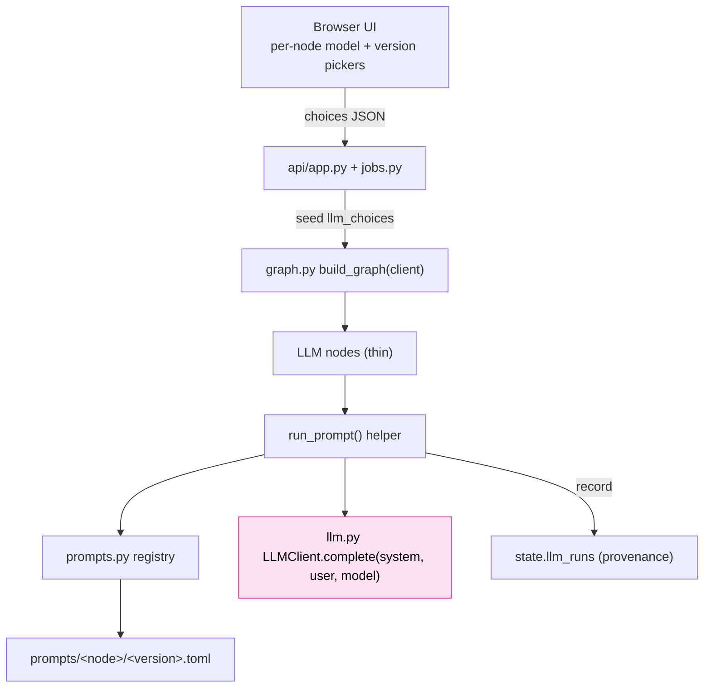
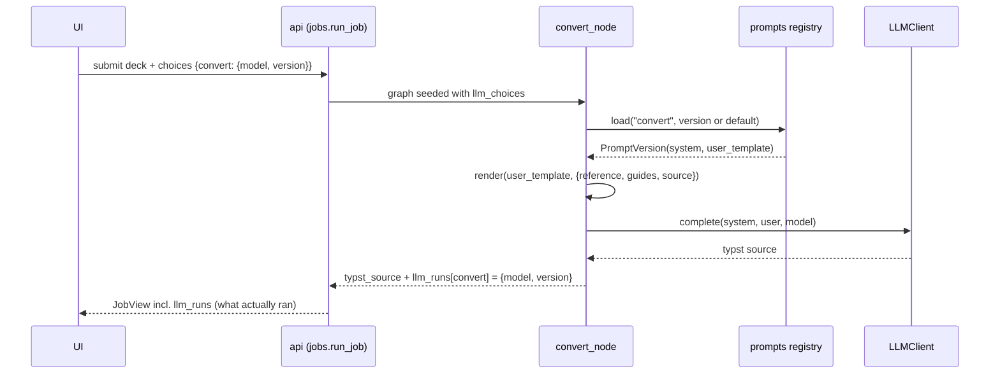

# Prompt Versioning and Per-Node LLM Selection - Design

Date: 2026-06-10
Status: proposed

## 1. Motivation

The roadmap adds several LLM nodes, each a distinct task: Beamer-to-Touying
translation (exists today), math/units/chem substitution, UA-1 tagging, alt-text
generation, compile-error fixing, and bibliography normalization. Each task needs
its own prompt, and prompts will be iterated on.

We want to establish the convention now, while the project has exactly one LLM
node (`convert`), so that every future LLM node inherits the same shape:

- Prompts live in the repo as versioned files (git is the history).
- The testing UI lets a developer pick a model and a prompt version per LLM node,
  then run any uploaded Beamer deck through that selection.
- What actually ran (model plus prompt version, per node) is recorded so a bad
  output can be traced back to the exact prompt that produced it.

Doing this with one node is cheap; retrofitting it across six is not.

## 2. Scope

In scope:

- A generic LLM client seam that supports a model chosen per call.
- A filesystem prompt registry with versions and a per-node default.
- Per-node selection (model and prompt version) threaded through the pipeline
  state.
- API endpoints and UI controls to choose per-node model and version and to see
  what ran.
- Faithful migration of the current `convert` prompt into the registry as
  `convert/v1`, with default-run behavior unchanged.

Out of scope (deferred until there is an evaluation harness to justify them):

- Live editing or authoring of prompts in the UI.
- Running one deck through multiple prompt versions at once for side-by-side
  comparison.
- An automated evaluation or scoring harness.
- Pinning a model or generation parameters (temperature, etc.) inside a prompt
  version.
- Persisting provenance beyond the in-memory job record.

## 3. Decisions already made (with rationale)

| Decision | Choice | Why |
| --- | --- | --- |
| Where prompts live | Repo files; UI selects, does not edit | Simplest, code-reviewable, git is the version history, fits "deterministic first" |
| What a version contains | System instruction plus user-message template | Lets us test both the instructions and how context is framed, not just wording |
| Large resources | Reference deck and guides stay as separate files the template references | Avoids copying large context into every version |
| Per-node UI control | Both model and prompt version per node | The user wants to test, for example, the math node on a strong model with prompt v2 while another node uses a cheaper model |
| Model/params in a version | No | YAGNI; the code uses provider defaults today |
| On-disk format | One TOML file per version, read with stdlib `tomllib` | Single file per version; literal triple-quoted strings need no escaping of LaTeX/Typst characters; no new dependency. YAML was rejected (indentation-sensitive for code-like text, and would make PyYAML a direct dependency) |

## 4. Architecture overview



The single client is bound into every LLM node, the model is chosen per call, and
each node resolves its own prompt version from the registry. Adding a future LLM
node means writing a prompt file plus a thin node function; nothing else changes.

## 5. Components

### 5.1 LLM client seam (`src/b2t/llm.py`)

Replace the task-specific converter with a general client.

```python
@runtime_checkable
class LLMClient(Protocol):
    def complete(self, system: str, user: str, model: str) -> str: ...
```

- `OpenRouterClient` (renamed from `OpenRouterConverter`): constructs the OpenAI
  client from `B2T_BASE_URL`/`OPENROUTER_BASE_URL` and `OPENROUTER_API_KEY`.
  `complete(system, user, model)` issues one chat-completions call with the given
  model and returns `choices[0].message.content`. The model is a per-call
  argument; an optional constructor default remains for convenience.
- `FakeClient` (renamed from `FakeConverter`): returns a canned string from
  `complete(...)`, ignoring inputs. Offline mode (UI checkbox, tests) routes every
  node through this. Known simplification: while only `convert` exists, one canned
  string suffices; when multiple nodes exist the fake can be made node-aware.

The system prompt constant `_INSTRUCTIONS` moves out of `llm.py` and into the
`convert/v1` prompt files (see 5.4), since instructions are now per node and
per version.

### 5.2 Prompt registry (`src/b2t/prompts.py` and `prompts/`)

Filesystem-driven, no new dependencies (TOML is read with stdlib `tomllib`).

```
prompts/
  defaults.json                 # { "convert": "v1" }
  convert/
    v1.toml                     # description, system, user_template
    v2.toml
```

Each version file is TOML with three keys, using literal triple-quoted strings
(`'''...'''`) so LaTeX/Typst characters need no escaping. Authors must use the
literal single-quote form, not basic double-quote (`"""..."""`) strings, which
process backslash escapes and would corrupt `\frac`, `\sqrt`, and the like:

```toml
description = "first working prompt"   # optional
system = '''...'''                     # the system instruction
user_template = '''...'''              # the user-message template with {{tokens}}
```

`PromptVersion` (dataclass): `node`, `version`, `system`, `user_template`,
`description`.

Loader functions (all accept an optional `base: Path`, default
`config.PROMPTS_DIR = REPO_ROOT / "prompts"`, so tests can point at a fixture):

- `list_nodes(base=...) -> list[str]` - subdirectories of `base` that contain at
  least one `*.toml` version file.
- `list_versions(node, base=...) -> list[str]` - the `*.toml` filename stems under
  `base/<node>`, sorted.
- `default_version(node, base=...) -> str` - read from `defaults.json`; raise
  `KeyError` if the node is absent (fail loud).
- `load(node, version, base=...) -> PromptVersion` - parse
  `base/<node>/<version>.toml` with `tomllib`; raise `FileNotFoundError` if the
  file is missing and `KeyError` if `system` or `user_template` is absent.

### 5.3 Template rendering

User templates contain LaTeX and Typst braces `{}` and math `$`, so Python's
`str.format` (braces) and `string.Template` (`$`) are both unsafe. Render with
literal replacement of distinctive double-brace tokens:

```python
def render(template: str, values: dict[str, str]) -> str:
    # replace each {{name}} with values[name]; raise on an unknown {{token}}
```

- Replace only the known token set for that node.
- Scan for any leftover `{{...}}` and raise, to catch a typo'd token early.

Tokens for `convert`: `{{reference}}`, `{{guides}}`, `{{source}}`.

### 5.4 Migrate the existing prompt

`prompts/convert/v1.toml` holds today's prompt: `system` is the current
`_INSTRUCTIONS` text verbatim, and `user_template` reproduces today's
user-message assembly.

```toml
description = "initial convert prompt, migrated verbatim"

system = '''
<the current _INSTRUCTIONS text, verbatim>
'''

user_template = '''
Reference Touying presentation:

{{reference}}

Guides:

{{guides}}

Convert this Beamer source to a Typst Touying deck:

{{source}}
'''
```

`defaults.json` maps `convert -> v1`. A default run (no UI override) produces the
same prompt the code sends today, so behavior is unchanged and the change is
low-risk.

### 5.5 State (`src/b2t/state.py`)

Add two Pydantic submodels and two fields.

```python
class NodeChoice(BaseModel):
    model: str | None = None           # None -> config.DEFAULT_MODEL
    prompt_version: str | None = None  # None -> registry default

class NodeRun(BaseModel):
    model: str
    prompt_version: str
```

`PipelineState` gains:

- `llm_choices: dict[str, NodeChoice]` - seeded at pipeline start, empty by
  default (every node uses defaults).
- `llm_runs: dict[str, NodeRun]` - provenance; each LLM node records what it
  actually used.

### 5.6 Shared runtime helper (`src/b2t/nodes/_llm.py`)

```python
def run_prompt(state, node_name, client, values) -> tuple[str, NodeRun]:
    choice = state.llm_choices.get(node_name) or NodeChoice()
    model = choice.model or DEFAULT_MODEL
    version = choice.prompt_version or prompts.default_version(node_name)
    pv = prompts.load(node_name, version)
    out = client.complete(pv.system, render(pv.user_template, values), model)
    return out, NodeRun(model=model, prompt_version=version)
```

Each LLM node stays thin. Example, `convert`:

```python
def convert_node(state, client):
    reference = REFERENCE_DECK.read_text(encoding="utf-8")
    guides = MATH_GUIDE.read_text(encoding="utf-8")
    out, run = run_prompt(state, "convert", client,
                          {"reference": reference, "guides": guides,
                           "source": state.stripped_tex})
    return {"typst_source": strip_code_fence(out),
            "llm_runs": {**state.llm_runs, "convert": run}}
```

Because the graph is linear, each node reads the latest `llm_runs` and merges its
own entry; last-writer-per-key is safe here. If the graph ever branches, switch
`llm_runs` to a LangGraph reducer.

### 5.7 Graph (`src/b2t/graph.py`)

`build_graph(client: LLMClient)` binds the one client into every LLM node via
`partial(node, client=client)`. Today that is just `convert`; the wiring is
identical for future LLM nodes.

### 5.8 Library entry point (`src/b2t/app.py`)

```python
def convert_deck(input_dir, output_dir, client=None, llm_choices=None) -> dict:
```

Defaults: `client = OpenRouterClient()`, `llm_choices = {}`. Seeds `llm_choices`
into the graph input alongside the paths.

### 5.9 API (`src/b2t/api/`)

- `GET /api/llm-nodes` -> `LLMNodesView`: a list of
  `{ node, versions: [{id, label}], default_version }`. `label` is the version's
  `description` key if present, else the id. Models continue to come
  from `GET /api/models`.
- `POST /api/jobs` and `POST /api/jobs/sample` accept an optional `choices` form
  field: JSON of `{ node: { model, prompt_version } }`. Parsed, validated, and
  passed to `run_job`.
- `run_job(...)` gains a `choices` argument and seeds `llm_choices` into the graph
  input.
- `JobRecord` and `JobView` gain `llm_runs: dict[str, {model, prompt_version}]`,
  populated from the final state, so the UI can show what ran.

Validation: an unknown node or version in `choices` is rejected with HTTP 400
before the job starts; an unknown model is allowed through (OpenRouter may accept
models not in the curated catalog), matching today's leniency.

### 5.10 UI (`src/b2t/api/static/`)

- Replace the single global model dropdown with a per-node block, auto-rendered
  from `/api/llm-nodes`. Each LLM node shows a model dropdown (from `/api/models`,
  default selected) and a version dropdown (default selected). Today only
  `convert` appears; future nodes appear automatically.
- On submit, gather the per-node selections into the `choices` JSON field.
- After a run, display provenance (model and version used per node) from the job
  view.
- Keep the "use fake converter (offline)" checkbox; it now routes all nodes to
  `FakeClient`.

## 6. Data flow (one run)



## 7. Error handling

- Missing node in `defaults.json`, or missing version files: raise; surfaces as a
  failed job with a clear message.
- Unknown `{{token}}` left in a rendered template: raise (typo guard).
- Unknown node or version in a submitted `choices` payload: HTTP 400 before the
  job runs.
- Client or network errors: propagate to the existing job failure boundary
  (status `failed`).
- A missing `OPENROUTER_API_KEY` continues to fail the job inside `run_job`, not
  the request handler (the client is built inside the failure boundary).

## 8. Testing

- `tests/test_prompts.py` (new): version discovery, default resolution, `load`,
  and a render case using brace-heavy and `$`-heavy content to prove the renderer
  does not corrupt LaTeX/Typst. Uses fixture `*.toml` versions under
  `tests/fixtures/prompts/`, not the real wording.
- `tests/test_llm.py`: update for `LLMClient`, `FakeClient`, `OpenRouterClient`,
  and the per-call model.
- `tests/test_nodes.py` and `tests/test_graph.py`: update for the helper, the new
  state fields, and `llm_runs` provenance.
- `tests/test_api_app.py`, `test_api_jobs.py`, `test_api_schemas.py`: cover
  `/api/llm-nodes`, the `choices` field, the 400 validation paths, and `llm_runs`
  in `JobView`.
- `tests/test_state.py`: the new fields and submodels.

All non-integration tests stay offline via `FakeClient`.

## 9. Migration and risk

- The only behavior-affecting change for existing default runs is the prompt
  moving from a constant into `convert/v1.toml`; the text is identical, so output
  is unchanged.
- Renames (`*Converter` to `*Client`) touch `llm.py`, `app.py`, `graph.py`, the
  `convert` node, the API, and their tests. This is mechanical and covered by the
  test suite.
- No new third-party dependencies.

## 10. Future extensions (not built now)

- Node-aware `FakeClient` once more than one LLM node exists.
- Side-by-side comparison: run one deck through several versions and diff results.
- An evaluation harness (fixture decks plus property checks) that makes version
  comparison objective; this is the prerequisite for any heavier versioning such
  as a managed prompt store.
- Per-node generation parameters, if a model turns out to need them.
