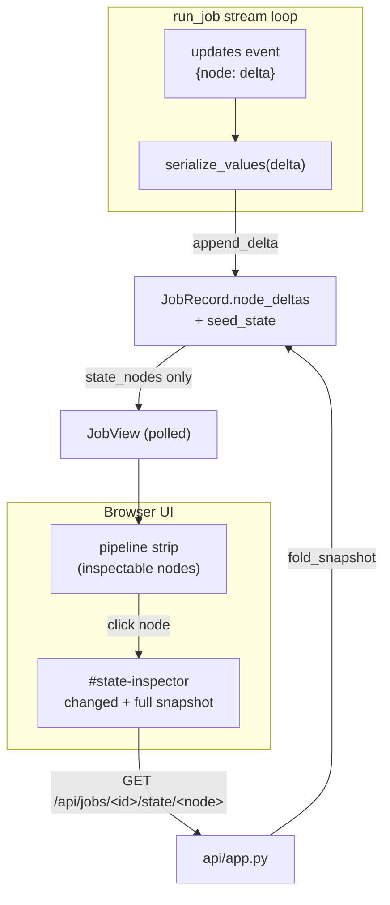
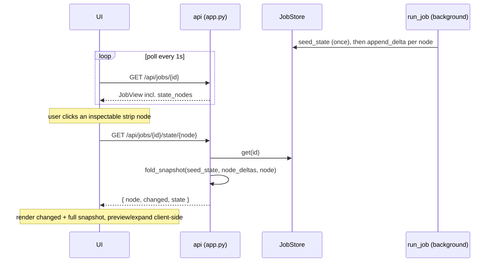

# Per-Node State Inspector for the Testing UI - Design

Date: 2026-06-10
Status: proposed

## 1. Motivation

When developing and testing the pipeline through the browser UI, there is no way
to see what the LangGraph `PipelineState` actually holds at each step. The UI
shows a summary of the final result (main file, includes, images, provenance) and
the generated Typst, but not the intermediate state: what `flatten` produced, what
`strip_overlays` removed, what the `convert` node received and returned. When a
conversion goes wrong, that intermediate state is exactly what you want to look
at.

This adds a per-node state inspector to the testing UI. Clicking a node in the
existing pipeline strip opens a panel showing the full accumulated state after
that node ran, with the fields that node changed highlighted. It is a development
and testing aid only, consistent with the UI's stated purpose.

The capture point already exists. `run_job` streams the graph with
`stream_mode=["updates", "debug"]`; each `updates` event is exactly
`{node_name: partial_state_dict}`, the delta that node returned. We serialize that
delta, store it on the job, and the inspector folds deltas on demand. No change to
the graph, the nodes, or `PipelineState`.

## 2. Scope

In scope:

- Capture each node's serialized delta live in `run_job`, as the node finishes.
- A new read-only endpoint that folds the seed plus the deltas up to a requested
  node into the full accumulated state and returns it, with the requested node's
  changed-field list.
- A small `state_nodes` list on the polled `JobView` so the strip knows which
  node boxes are inspectable (including the partial set left by a mid-pipeline
  failure).
- A frontend inspector panel: click an inspectable node in the strip to view its
  snapshot, with the changed fields highlighted and long string values shown as a
  preview that expands on demand.

Out of scope:

- Editing state from the UI. The inspector is read-only.
- Persisting snapshots beyond the in-memory job record.
- Diffing two arbitrary nodes side by side. The "what changed here" highlight is
  per node only.
- A LangGraph checkpointer or `get_state_history()`. Considered and rejected in
  section 3.
- Any change to the library entry point (`app.convert_deck`). This is a
  testing-UI feature.

## 3. Decisions already made (with rationale)

| Decision | Choice | Why |
| --- | --- | --- |
| What to show | Full accumulated snapshot after each node, plus that node's delta highlighted | User selection; the delta is free (it is exactly the stream chunk) and "what changed here" is the most useful debugging cue |
| Large fields | Preview plus expand | User selection; small fields shown in full, long strings (e.g. `flattened_tex`, `typst_source`, `llm_rendered`) previewed with a character count and an expand toggle |
| UI placement | Click a node in the existing pipeline strip | User selection; reuses the strip, no new top-level section |
| Timing | Live, as each node finishes | User selection; lets you inspect finished nodes mid-run and, crucially, keeps every snapshot up to the point of a mid-pipeline failure |
| Capture and storage | Store per-node deltas, fold on read (approach A) | User selection; each field value is stored once (no duplicating the embedded reference deck across snapshots), the delta highlight is the stored `changed` list, and the fold is a tiny loop |
| Preview vs expand split | Server sends one node's full snapshot on click; the browser previews and expands client-side | One node at a time is tens of KB at worst; avoids a field-level expand endpoint and server-side truncation logic |
| Snapshot fidelity | Fold starts from the serialized seed | So the snapshot shows `input_dir`, `output_dir`, and `llm_choices` too, matching the real `PipelineState` |
| Endpoint shape | Dedicated lazy endpoint, not in the poll | The polled `JobView` (hit every second) must not carry snapshot bodies; only the short `state_nodes` list rides along |

Approach C (LangGraph checkpointer plus `get_state_history()`) was rejected: it is
meaningfully more machinery (thread ids, checkpointer config, interpreting
`StateSnapshot` metadata to map "after node X"), still needs the same JSON-safe
serializer, changes graph construction, and pre-empts the checkpointer earmarked
for the human-in-the-loop roadmap item. Approach B (store full snapshots per node)
was rejected only for needlessly duplicating the large embedded strings; it is
otherwise equivalent to A.

## 4. Architecture overview



Capture is live and inside the loop, so a node that later raises leaves every
prior node's snapshot intact. Reading is lazy: nothing but the short `state_nodes`
list is sent until the user clicks a node.

## 5. Components

### 5.1 Serialization and folding (`src/b2t/api/state_view.py`, new)

A small module, isolated so `jobs.py` and `app.py` stay focused.

```python
def to_jsonsafe(value):
    """Convert one PipelineState value to a JSON-safe form."""
    if isinstance(value, Path):
        return str(value)
    if isinstance(value, BaseModel):
        return value.model_dump()
    if isinstance(value, (list, tuple)):
        return [to_jsonsafe(v) for v in value]
    if isinstance(value, dict):
        return {k: to_jsonsafe(v) for k, v in value.items()}
    if isinstance(value, (str, int, float, bool)) or value is None:
        return value
    return str(value)  # debug tool: stringify rather than crash

def serialize_values(d: dict) -> dict:
    """Apply to_jsonsafe to each value of a dict (a delta or the seed)."""
    return {k: to_jsonsafe(v) for k, v in d.items()}

@dataclass
class NodeDelta:
    node: str
    changed: list[str]
    values: dict  # already JSON-safe

def fold_snapshot(seed_state, deltas, node) -> tuple[list[str], dict]:
    """Fold the seed plus deltas up to and including `node`.

    Returns that node's changed list and the accumulated state dict.
    Raises KeyError if `node` has no delta.
    """
    acc = dict(seed_state)
    changed: list[str] | None = None
    for d in deltas:
        acc.update(d.values)
        if d.node == node:
            changed = d.changed
            break
    if changed is None:
        raise KeyError(node)
    return changed, acc
```

`to_jsonsafe` covers every type actually present in `PipelineState`: `Path` and
`list[Path]`, the `str | None` text fields, the `bool` flags, and the
`NodeChoice` / `NodeRun` / `RenderedPrompt` Pydantic submodels inside
`llm_choices` / `llm_runs` / `llm_rendered`. An unexpected type is stringified by
the final `return str(value)` rather than crashing the debug tool.

### 5.2 Job record and store (`src/b2t/api/jobs.py`)

`JobRecord` gains two fields:

- `seed_state: dict = field(default_factory=dict)` - the serialized seed
  (`input_dir`, `output_dir`, `llm_choices`), the base of every fold.
- `node_deltas: list[NodeDelta] = field(default_factory=list)` - one entry per
  node that has finished, in run order.

`JobStore` gains one method, because appending to a list is not expressible
through the existing replace-style `update`:

```python
def append_delta(self, job_id: str, delta: NodeDelta) -> None:
    with self._lock:
        self._jobs[job_id].node_deltas.append(delta)
```

`run_job` changes in two places:

- After building `seed`, record its serialized form once:
  `store.update(job_id, seed_state=serialize_values(seed))`.
- In the `updates` branch, iterate `chunk.items()` to get the node name, and after
  `state.update(update)` capture the delta:

```python
else:
    for node, update in chunk.items():
        state.update(update)
        store.append_delta(
            job_id, NodeDelta(node, list(update), serialize_values(update))
        )
```

The existing `except` path is untouched: because capture happens inside the loop
as each node completes, a later exception leaves the already-captured deltas in
place. The post-loop summary copy (`main_tex`, `llm_runs`, etc.) is unchanged.

### 5.3 Schema and endpoint (`src/b2t/api/schemas.py`, `app.py`)

`schemas.py`:

```python
class NodeStateView(BaseModel):
    node: str
    changed: list[str]
    state: dict[str, Any]
```

`JobView` gains `state_nodes: list[str] = []`, filled by `to_view` from
`[d.node for d in job.node_deltas]`. This is the only addition to the polled
payload: a handful of short node names, telling the strip which boxes are
clickable, including the partial set after a mid-pipeline failure. Snapshot bodies
never enter `JobView`.

`app.py` adds one route:

`GET /api/jobs/{id}/state/{node}` -> `NodeStateView`:

- 404 if the job is unknown.
- 404 if `node` has no delta yet (not run, or did not run before a failure);
  the `KeyError` from `fold_snapshot` maps to 404.
- Otherwise return `NodeStateView(node=node, changed=changed, state=state)` from
  `fold_snapshot(job.seed_state, job.node_deltas, node)`.

This mirrors the existing `/api/jobs/{id}/prompt/{node}` 404 behavior.

### 5.4 Frontend (`static/index.html`, `app.js`, `style.css`)

`index.html`:

- Add one container, `<div id="state-inspector"></div>`, directly under `#graph`.

`app.js`:

- During polling, remember the latest `job.state_nodes`. In the strip, add an
  `inspectable` class to those node boxes (a pointer cursor and a subtle accent).
- A click handler on an inspectable node fetches
  `/api/jobs/{currentJobId}/state/{node}`, marks that box `selected`, and renders
  the panel: a `State after: {node}` title, a `changed: f1, f2` line, then the
  state rendered by a recursive `renderValue`:
  - primitives (`bool`, number, `null`) inline;
  - strings: shown in full if short; if longer than a threshold (about 500
    chars), a preview plus `(N chars)` and an `[expand]` toggle that reveals the
    already-fetched full text;
  - arrays and objects: recursed, so inner long strings (for example
    `llm_rendered.convert.user`) get the same preview and expand treatment.
- All preview and expand is client-side on the snapshot already received; the
  server sends one node's full snapshot per click. On fetch failure the panel
  shows an inline message and leaves the strip usable.

`style.css`:

- `.node.inspectable { cursor: pointer }`, a `.node.selected` accent, and
  `#state-inspector` rules for the panel, the `changed` line, each field row, and
  the expand toggle, matching the existing flat style.

## 6. Data flow (inspecting a node)



## 7. Error handling

- `/api/jobs/{id}/state/{node}`: unknown job or not-yet-run node -> 404. The panel
  shows the message inline.
- The serializer is total over the field types in `PipelineState`; an unexpected
  type is stringified rather than raising.
- Capture cannot break a conversion: it is plain dict and list work on data the
  node already returned, and it runs after `state.update`, so a capture issue
  could not corrupt the pipeline result.
- The fold is read-only over stored JSON-safe dicts and cannot mutate the job.

## 8. Testing

- `tests/test_state_view.py` (new):
  - `to_jsonsafe` over `Path`, `list[Path]`, a `NodeRun`, a `RenderedPrompt`, and
    a nested `dict[str, BaseModel]`; primitives pass through; an unexpected type is
    stringified.
  - `serialize_values` on a mixed delta.
  - `fold_snapshot`: folds in order, returns the requested node's `changed`, and
    raises `KeyError` for an unknown node; the seed base appears in the result.
- `tests/test_api_jobs.py`: a fake-converter run on the sample deck populates
  `node_deltas` for all eight nodes in run order; `convert`'s `changed` includes
  `typst_source`, `llm_runs`, and `llm_rendered`; `seed_state` holds the input and
  output dirs. A deliberately broken deck (so `detect_main` raises) leaves the
  partial `node_deltas` (`copy_input`, `clean_build`) intact and the job `failed`.
- `tests/test_api_app.py`: after a run, `GET /api/jobs/{id}/state/convert` returns
  200 with `changed` and a `state` containing `stripped_tex` and `typst_source`;
  404 for an unknown job and for a not-yet-run node; `JobView` carries
  `state_nodes` covering the finished nodes.
- `tests/test_api_schemas.py`: `NodeStateView` shape; `to_view` populates
  `state_nodes`; `JobView` does not carry any snapshot body.

All non-integration tests stay offline via `FakeClient`.

## 9. Migration and risk

- Additive API change: one new endpoint and one new `JobView` field
  (`state_nodes`, defaulted), so existing consumers are unaffected.
- No new third-party Python dependencies; `to_jsonsafe` uses the stdlib and
  Pydantic's `model_dump`.
- `run_job`'s `updates` branch changes from `chunk.values()` to `chunk.items()`;
  behavior is identical on the linear graph (one node per step) and the existing
  state accumulation is preserved.
- Snapshots (including the large embedded reference deck inside
  `llm_rendered`, stored once per run as a delta) are held in memory per job and
  served only on demand. Fine for a local single-user tool; lost on restart like
  every other job field.

## 10. Future extensions (not built now)

- A diff view between two nodes, building on the per-node `changed` lists.
- A "copy snapshot as JSON" button for pasting into bug reports.
- Reusing `to_jsonsafe` if a future need arises to serialize full state elsewhere
  (it is deliberately generic, though it currently lives in `api/`).
- Field-level lazy expansion endpoints if snapshots ever grow beyond what is
  comfortable to send in one response (not a concern at v0 sizes).
